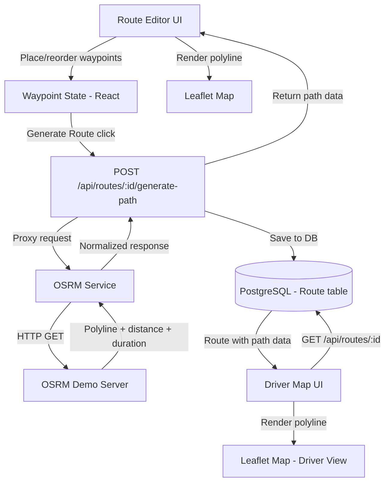

# Design Document: Custom Route Navigation

## Overview

This feature adds waypoint-based route navigation to the milk delivery platform. Admins define delivery routes by placing ordered waypoints (customer stops + intermediate waypoints) on a Leaflet map. The system calls OSRM to generate road-following polylines between waypoints, which are stored in the database and displayed to both admins (for verification) and drivers (for navigation).

The approach is waypoint-based: admins control the path by placing intermediate waypoints at key turns/roads, and OSRM auto-generates the actual road geometry between them. This avoids manual polyline drawing while giving admins precise control over which roads the vehicle should follow.

### Key Design Decisions

1. **OSRM via backend proxy**: The client never calls OSRM directly. A backend endpoint accepts waypoints and proxies the request to OSRM, allowing URL configuration, error normalization, and future caching.
2. **Polyline stored as encoded string**: The Google Encoded Polyline format is compact and widely supported. Decoding happens client-side for rendering.
3. **Waypoints stored as JSON column**: A JSON array on the Route model avoids a separate table for waypoints while keeping the data co-located with the route. Intermediate waypoints have no foreign key relationships.
4. **Staleness detection via waypoint hash**: Rather than complex diffing, we compare a hash/snapshot of the current waypoints against the waypoints used at generation time to detect staleness.

## Architecture



### Request Flow

1. Admin places waypoints on the map in the Route Editor
2. Admin clicks "Generate Route" → frontend sends `POST /api/routes/:id/generate-path` with ordered waypoints
3. Backend validates waypoints (≥2 required), calls OSRM Route API
4. OSRM returns encoded polyline, distance, duration
5. Backend stores polyline, waypoints JSON, distance, duration, and generation timestamp on the Route record
6. Response returns the path data to the frontend for immediate rendering
7. Driver opens their delivery map → `GET /api/routes/:id` returns route with stored path data
8. Driver's map decodes and renders the polyline

## Components and Interfaces

### Backend Components

#### 1. OSRM Service (`src/server/lib/osrm.ts`)

Pure utility module for communicating with the OSRM API.

```typescript
interface OsrmWaypoint {
  latitude: number;
  longitude: number;
}

interface OsrmRouteResult {
  polyline: string;          // Encoded polyline string
  distanceMeters: number;    // Total distance in meters
  durationSeconds: number;   // Estimated duration in seconds
}

// Calls OSRM Route API with ordered waypoints
async function generateRoutePath(waypoints: OsrmWaypoint[]): Promise<OsrmRouteResult>;
```

- Uses `OSRM_BASE_URL` env var (defaults to `https://router.project-osrm.org`)
- Constructs URL: `{base}/route/v1/driving/{lon1},{lat1};{lon2},{lat2};...?overview=full&geometries=polyline`
- Throws typed errors for network failures, no-route-found, and API errors

#### 2. Route Path Types (`src/server/modules/routes/routes.types.ts` — additions)

```typescript
interface RouteWaypoint {
  latitude: number;
  longitude: number;
  type: 'customer_stop' | 'intermediate';
  routeCustomerId: string | null;
}

// Zod schema for generate-path endpoint
const generatePathSchema = z.object({
  waypoints: z.array(z.object({
    latitude: z.number().min(-90).max(90),
    longitude: z.number().min(-180).max(180),
    type: z.enum(['customer_stop', 'intermediate']),
    routeCustomerId: z.string().uuid().nullable(),
  })).min(2, 'At least 2 waypoints are required'),
});
```

#### 3. Route Path Controller & Route (`src/server/modules/routes/routes.controller.ts` — additions)

New endpoint: `POST /routes/:id/generate-path`
- Validates waypoints via Zod schema
- Calls OSRM service
- Saves result to Route record
- Returns path data

New endpoint: `GET /routes/:id/path`
- Returns stored path data (polyline, waypoints, distance, duration, generation timestamp, staleness)

#### 4. Polyline Codec (`src/server/lib/polyline.ts`)

Encode/decode functions for the Google Encoded Polyline Algorithm.

```typescript
function encodePolyline(coordinates: Array<[number, number]>): string;
function decodePolyline(encoded: string): Array<[number, number]>;
```

Used server-side for any path manipulation. Client-side decoding uses the same algorithm inline.

#### 5. Waypoint Serialization (`src/server/lib/waypoints.ts`)

```typescript
function serializeWaypoints(waypoints: RouteWaypoint[]): string; // JSON.stringify
function deserializeWaypoints(json: string): RouteWaypoint[];    // JSON.parse + validation
```

### Frontend Components

#### 1. Route Editor Map Enhancement (`RouteFormPage.tsx` — additions)

Extends the existing RouteFormPage with:
- Map click handler to add intermediate waypoints
- Draggable markers for repositioning waypoints
- Numbered markers with color distinction (blue for customer stops, orange for intermediate)
- Waypoint list panel with drag-to-reorder and delete buttons
- "Generate Route" button
- Polyline overlay rendering
- Distance/duration display
- Stale path indicator
- Loading state during generation

#### 2. Driver Route Map Component (`src/client/pages/delivery/DriverRouteMap.tsx`)

New component or enhancement to existing delivery pages:
- Renders stored polyline on Leaflet map
- Shows numbered customer stop markers
- Displays distance/duration summary panel
- Graceful fallback when no path exists (markers only)

### API Endpoints

| Method | Path | Description |
|--------|------|-------------|
| `POST` | `/api/routes/:id/generate-path` | Generate OSRM path from waypoints, save to DB |
| `GET` | `/api/routes/:id/path` | Get stored path data for a route |

The existing `GET /api/routes/:id` response will also include the new path fields.

## Data Models

### Prisma Schema Changes (Route model additions)

```prisma
model Route {
  // ... existing fields ...

  // Route navigation fields
  routePath           String?   @map("route_path") @db.Text          // Encoded polyline
  routeWaypoints      Json?     @map("route_waypoints")              // JSON array of RouteWaypoint
  routeDistanceMeters Float?    @map("route_distance_meters")        // Total distance in meters
  routeDurationSeconds Float?   @map("route_duration_seconds")       // Estimated duration in seconds
  routePathGeneratedAt DateTime? @map("route_path_generated_at") @db.Timestamptz // When path was last generated
}
```

### RouteWaypoint JSON Structure

```json
[
  {
    "latitude": 12.971599,
    "longitude": 77.594566,
    "type": "customer_stop",
    "routeCustomerId": "uuid-of-route-customer"
  },
  {
    "latitude": 12.972100,
    "longitude": 77.595200,
    "type": "intermediate",
    "routeCustomerId": null
  }
]
```

### Migration

A new Prisma migration adds the five nullable columns to the `routes` table. All existing routes will have `null` values for these fields, which the UI interprets as "no path configured."

### Staleness Detection

The system determines staleness by comparing the current route's customer stops (from `RouteCustomer` records) against the `customer_stop` entries in the stored `routeWaypoints` JSON. If the set of customer stop coordinates or their order differs, the path is considered stale. This comparison happens at read time (in the API response) rather than via a separate database flag.


## Correctness Properties

*A property is a characteristic or behavior that should hold true across all valid executions of a system — essentially, a formal statement about what the system should do. Properties serve as the bridge between human-readable specifications and machine-verifiable correctness guarantees.*

### Property 1: Waypoint add/remove round-trip

*For any* valid waypoint list and any valid coordinate, appending a new intermediate waypoint and then removing the last waypoint should produce a list equivalent to the original.

**Validates: Requirements 1.1, 1.6**

### Property 2: Customer stop auto-population matches RouteCustomer data

*For any* set of RouteCustomer records with non-null drop coordinates, the auto-populated customer stop waypoints should have the same count, the same coordinates (in sequence order), type `customer_stop`, and matching `routeCustomerId` values.

**Validates: Requirements 1.2**

### Property 3: Waypoint coordinate update only affects target waypoint

*For any* waypoint list of length ≥ 1 and any valid index within that list, updating the coordinates at that index should leave all other waypoints unchanged in position and type.

**Validates: Requirements 1.4**

### Property 4: Waypoint reorder preserves set contents

*For any* waypoint list and any valid permutation of indices, reordering the waypoints should produce a list containing exactly the same waypoints (same coordinates and types) with updated sequence numbers matching the new order.

**Validates: Requirements 1.5**

### Property 5: Coordinate formatting precision

*For any* latitude in [-90, 90] and longitude in [-180, 180], the formatted display string should contain at least 6 decimal places.

**Validates: Requirements 1.7**

### Property 6: OSRM URL construction includes all waypoints in order

*For any* ordered list of 2 or more waypoints, the constructed OSRM request URL should contain all waypoint coordinates in the correct `{longitude},{latitude}` format, separated by semicolons, in the same order as the input list.

**Validates: Requirements 2.1, 2.2**

### Property 7: OSRM response parsing extracts correct values

*For any* valid OSRM response JSON containing a route with distance, duration, and geometry fields, the parsed result should have `distanceMeters` equal to the response's distance, `durationSeconds` equal to the response's duration, and `polyline` equal to the response's geometry string.

**Validates: Requirements 2.5**

### Property 8: Waypoint serialization round-trip

*For any* valid waypoint array (each waypoint having latitude in [-90,90], longitude in [-180,180], type of `customer_stop` or `intermediate`, and routeCustomerId as a UUID string or null), serializing to JSON then deserializing should produce an equivalent waypoint array.

**Validates: Requirements 3.2, 7.1, 7.2, 7.3**

### Property 9: Polyline encode/decode round-trip

*For any* valid coordinate sequence (latitudes in [-90,90], longitudes in [-180,180]), encoding to a polyline string then decoding should produce coordinates within 0.00001 degrees of the original values.

**Validates: Requirements 7.4, 7.5**

### Property 10: Staleness detection

*For any* route with a stored path and waypoints, if the current customer stop coordinates or order differ from the stored waypoints' customer stops, the staleness check should return true. If they are identical, it should return false.

**Validates: Requirements 3.5, 6.3**

### Property 11: Distance and duration formatting

*For any* non-negative distance in meters, the formatted string should express the value in kilometers (e.g., "X.X km"). *For any* non-negative duration in seconds, the formatted string should express the value in hours and minutes (e.g., "Xh Ym" or "Ym" when under an hour).

**Validates: Requirements 4.2**

## Error Handling

| Scenario | Handling |
|----------|----------|
| OSRM server unreachable | Backend returns 502 with message "Route generation service is unavailable. Please try again later." |
| OSRM returns no route found | Backend returns 422 with message "No road-following route could be found between the provided waypoints. Try adjusting waypoint positions." |
| OSRM returns unexpected response format | Backend returns 502 with message "Unexpected response from routing service." |
| Fewer than 2 waypoints submitted | Backend returns 400 with Zod validation error "At least 2 waypoints are required." |
| Invalid coordinates (out of range) | Backend returns 400 with Zod validation error for latitude/longitude bounds. |
| Route not found (invalid route ID) | Backend returns 404 "Route not found" (existing error handling). |
| OSRM request timeout | Backend sets a 10-second timeout on the fetch call; returns 502 on timeout. |
| Polyline decode failure on client | Client catches error, hides polyline overlay, shows "Unable to display route path" message. |

### Frontend Error Display

- OSRM errors are shown as toast notifications in the Route Editor
- Validation errors (< 2 waypoints) are shown inline near the "Generate Route" button
- Network errors show a retry-able error state

## Testing Strategy

### Property-Based Tests (fast-check + vitest)

Each correctness property maps to a single property-based test with a minimum of 100 iterations. Tests are tagged with the property reference.

| Test File | Properties Covered |
|-----------|-------------------|
| `src/server/lib/polyline.test.ts` | Property 9 (polyline round-trip) |
| `src/server/lib/waypoints.test.ts` | Property 8 (waypoint serialization round-trip), Property 2 (customer stop auto-population), Property 10 (staleness detection) |
| `src/server/lib/osrm.test.ts` | Property 6 (URL construction), Property 7 (response parsing) |
| `src/client/lib/routeFormatters.test.ts` | Property 5 (coordinate precision), Property 11 (distance/duration formatting) |
| `src/client/lib/waypointOperations.test.ts` | Property 1 (add/remove round-trip), Property 3 (coordinate update isolation), Property 4 (reorder preserves contents) |

Each test must include a comment tag in the format:
```
// Feature: custom-route-navigation, Property {N}: {property title}
```

### Unit Tests (vitest)

Unit tests cover specific examples, edge cases, and integration points:

- OSRM service: error responses (network failure, no-route, timeout), env var configuration
- Waypoint validation: fewer than 2 waypoints rejected, invalid coordinate ranges
- Polyline: empty coordinate array, single coordinate
- Route path controller: end-to-end generate-path flow with mocked OSRM
- Staleness: exact match returns not stale, added customer returns stale

### Integration Tests

- `POST /routes/:id/generate-path` with mocked OSRM: validates full request/response cycle
- `GET /routes/:id` includes path fields when present
- `PUT /routes/:id/customers` triggers staleness on subsequent path read

### Testing Libraries

- **vitest**: Test runner (already configured)
- **fast-check**: Property-based testing library (already in devDependencies)
- Minimum 100 iterations per property test (`fc.assert(fc.property(...), { numRuns: 100 })`)
