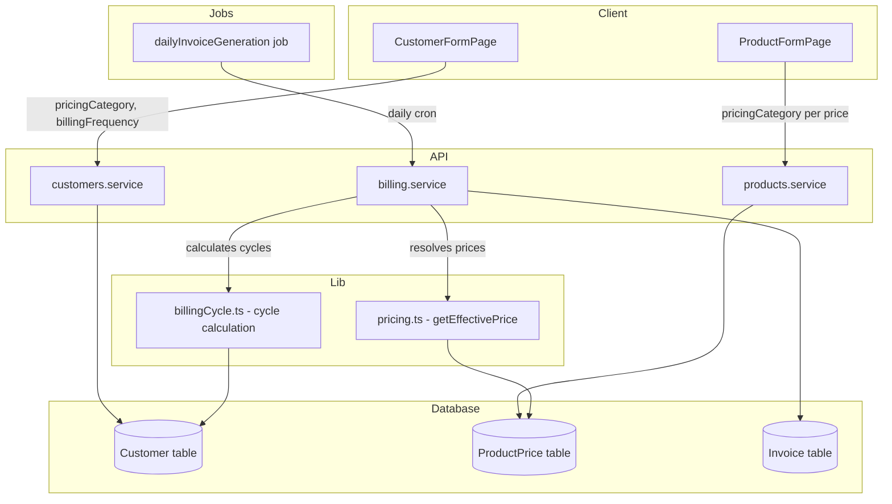

# Design Document: Customer Pricing Tiers & Flexible Billing

## Overview

This feature extends the milk delivery platform with two major capabilities:

1. **Per-customer pricing categories** — Each customer is assigned one of three pricing tiers ("Cat 1", "Cat 2", "Cat 3"). Product variant prices are stored per category, and the price resolver uses the customer's category when looking up unit prices for invoicing.

2. **Configurable billing frequency** — Each customer can be billed on a schedule other than monthly: daily, every 2 days, weekly, every 10 days, or monthly. The billing job shifts from a monthly-only cron to a daily cron that evaluates which customers' billing cycles have ended and generates invoices accordingly.

Both features require schema changes (new fields on `Customer`, new column on `ProductPrice`, new enums), updates to the price resolution logic, a rewrite of the billing job, and UI changes to the customer and product forms.

### Key Design Decisions

- **Pricing category on ProductPrice, not a separate table**: Adding `pricingCategory` directly to the `ProductPrice` model keeps the query simple (single table lookup with the existing index pattern) and avoids joins. The unique constraint extends to include the category.
- **Null category as fallback**: Existing prices with `pricingCategory = null` serve as the default fallback, preserving backward compatibility and enabling a gradual migration.
- **Daily billing job replaces monthly**: A single daily cron replaces the monthly cron. The job calculates each customer's cycle boundaries from their `billingFrequency` and the date of their last invoice, then generates invoices for any completed cycles.
- **Per-customer error isolation**: If invoice generation fails for one customer, the job logs the error and continues with the next customer, ensuring one failure doesn't block the entire run.

## Architecture



The architecture changes are additive — no existing modules are removed. The monthly invoice job is replaced by a daily invoice job. A new utility module (`billingCycle.ts`) encapsulates cycle date calculation logic so it can be unit-tested independently.

## Components and Interfaces

### 1. Prisma Schema Changes

**Customer model** — two new fields:
- `pricingCategory PricingCategory @default(cat_1)` 
- `billingFrequency BillingFrequency @default(monthly)`

**ProductPrice model** — one new field:
- `pricingCategory PricingCategory?` (nullable for backward-compatible fallback)
- Unique constraint updated: `[productVariantId, effectiveDate, branch, pricingCategory]`

**New enums**:
- `PricingCategory { cat_1, cat_2, cat_3 }`
- `BillingFrequency { daily, every_2_days, weekly, every_10_days, monthly }`

### 2. Price Resolver (`src/server/lib/pricing.ts`)

Updated signature:
```typescript
export async function getEffectivePrice(
  variantId: string,
  targetDate: Date,
  branch?: string | null,
  pricingCategory?: PricingCategory | null,
): Promise<ProductPrice>
```

Resolution order:
1. If `pricingCategory` is provided and `branch` is provided: look for branch + category match
2. If found, return. Otherwise fall back to branch + null category
3. If no branch match: look for null branch + category match
4. Final fallback: null branch + null category
5. Throw `NotFoundError` if nothing found

### 3. Billing Cycle Calculator (`src/server/lib/billingCycle.ts`)

New module:
```typescript
export interface BillingCycle {
  start: Date;
  end: Date;
}

/** Given a billing frequency and a reference date, compute the cycle that contains that date. */
export function getCycleForDate(frequency: BillingFrequency, referenceDate: Date): BillingCycle;

/** Given a customer's last invoice end date and their frequency, compute the next cycle. */
export function getNextCycle(frequency: BillingFrequency, lastCycleEnd: Date): BillingCycle;

/** Check if a cycle has ended relative to a given "today" date. */
export function isCycleComplete(cycle: BillingCycle, today: Date): boolean;
```

Cycle rules:
- `daily`: single day (start = end)
- `every_2_days`: 2-day window
- `weekly`: 7-day window
- `every_10_days`: 10-day window
- `monthly`: calendar month (1st to last day)

### 4. Billing Service (`src/server/modules/billing/billing.service.ts`)

New function:
```typescript
export async function generateInvoiceForCustomer(
  customerId: string,
  cycleStart: Date,
  cycleEnd: Date,
): Promise<Invoice>
```

Updated `generateInvoicesForCycle` is replaced by a new `runDailyBillingJob` function that:
1. Queries all active customers
2. For each customer, determines their next billing cycle based on `billingFrequency` and their most recent invoice's `billingCycleEnd`
3. If the cycle is complete (end date ≤ today), generates an invoice
4. Passes `customer.pricingCategory` to `getEffectivePrice` for each line item
5. Wraps each customer in a try/catch for error isolation
6. Returns a summary with counts and errors

### 5. Daily Invoice Generation Job (`src/server/jobs/dailyInvoiceGeneration.ts`)

Replaces `monthlyInvoiceGeneration.ts`. Runs daily via cron. Supports manual trigger with explicit cycle dates.

### 6. Customer Types & Validation (`src/server/modules/customers/customers.types.ts`)

Updated schemas to include:
- `pricingCategory: z.enum(['cat_1', 'cat_2', 'cat_3']).optional()` (defaults to `cat_1`)
- `billingFrequency: z.enum(['daily', 'every_2_days', 'weekly', 'every_10_days', 'monthly']).optional()` (defaults to `monthly`)

### 7. Product Types & Validation (`src/server/modules/products/products.types.ts`)

Updated `addPriceSchema` to include:
- `pricingCategory: z.enum(['cat_1', 'cat_2', 'cat_3']).nullable().optional()`

### 8. Customer Form UI (`src/client/pages/customers/CustomerFormPage.tsx`)

Add two new `<select>` fields:
- Pricing Category: options "Cat 1", "Cat 2", "Cat 3"
- Billing Frequency: options "Daily", "Every 2 Days", "Weekly", "Every 10 Days", "Monthly"

### 9. Product Form UI (`src/client/pages/products/ProductFormPage.tsx`)

Add a pricing category selector to the price entry form within each variant. When managing prices, show inputs for all three categories.

### 10. Database Migration

A Prisma migration that:
1. Creates the `PricingCategory` and `BillingFrequency` enums
2. Adds `pricing_category` column to `customers` with default `cat_1`
3. Adds `billing_frequency` column to `customers` with default `monthly`
4. Adds `pricing_category` column to `product_prices` (nullable)
5. Drops the old unique constraint on `product_prices` and creates the new one including `pricing_category`
6. Updates the lookup index on `product_prices` to include `pricing_category`

## Data Models

### Updated Customer Model

```
Customer
├── id: UUID (PK)
├── name: VARCHAR(255)
├── phone: VARCHAR(20) UNIQUE
├── email: VARCHAR(255)?
├── status: CustomerStatus (active | paused | stopped)
├── pricingCategory: PricingCategory (cat_1 | cat_2 | cat_3) DEFAULT cat_1  ← NEW
├── billingFrequency: BillingFrequency (daily | every_2_days | weekly | every_10_days | monthly) DEFAULT monthly  ← NEW
├── deliveryNotes: TEXT?
├── preferredDeliveryWindow: VARCHAR(50)?
├── routeId: UUID? → Route
├── createdAt: TIMESTAMPTZ
└── updatedAt: TIMESTAMPTZ
```

### Updated ProductPrice Model

```
ProductPrice
├── id: UUID (PK)
├── productVariantId: UUID → ProductVariant
├── price: DECIMAL(10,2)
├── effectiveDate: DATE
├── branch: VARCHAR(100)?
├── pricingCategory: PricingCategory?  ← NEW (nullable for fallback)
├── createdAt: TIMESTAMPTZ
├── UNIQUE(productVariantId, effectiveDate, branch, pricingCategory)
└── INDEX(productVariantId, effectiveDate DESC, pricingCategory)
```

### Enum Definitions

```sql
CREATE TYPE "PricingCategory" AS ENUM ('cat_1', 'cat_2', 'cat_3');
CREATE TYPE "BillingFrequency" AS ENUM ('daily', 'every_2_days', 'weekly', 'every_10_days', 'monthly');
```

### Billing Cycle Calculation Reference

| Frequency     | Cycle Length | Example (ref: Jan 1)       |
|---------------|-------------|----------------------------|
| daily         | 1 day       | Jan 1 → Jan 1              |
| every_2_days  | 2 days      | Jan 1 → Jan 2              |
| weekly        | 7 days      | Jan 1 → Jan 7              |
| every_10_days | 10 days     | Jan 1 → Jan 10             |
| monthly       | calendar mo | Jan 1 → Jan 31             |


## Correctness Properties

*A property is a characteristic or behavior that should hold true across all valid executions of a system — essentially, a formal statement about what the system should do. Properties serve as the bridge between human-readable specifications and machine-verifiable correctness guarantees.*

### Property 1: Pricing category validation rejects invalid values

*For any* string that is not one of "cat_1", "cat_2", or "cat_3", attempting to create or update a customer with that string as `pricingCategory` should be rejected by validation, and the customer record should remain unchanged.

**Validates: Requirements 1.1, 1.5**

### Property 2: Billing frequency validation rejects invalid values

*For any* string that is not one of "daily", "every_2_days", "weekly", "every_10_days", or "monthly", attempting to create or update a customer with that string as `billingFrequency` should be rejected by validation, and the customer record should remain unchanged.

**Validates: Requirements 4.1, 4.5**

### Property 3: Customer field update round-trip

*For any* valid pricing category and billing frequency values, updating a customer's `pricingCategory` and `billingFrequency` and then reading the customer back should return the exact values that were set.

**Validates: Requirements 1.3, 4.3**

### Property 4: Product price category uniqueness constraint

*For any* two product price entries with the same (productVariantId, effectiveDate, branch, pricingCategory), the second insert should be rejected with a conflict error.

**Validates: Requirements 2.2**

### Property 5: Price entry validation rejects invalid pricing category

*For any* string that is not one of the three allowed pricing category values (or null), attempting to add a price entry with that string as `pricingCategory` should be rejected by validation.

**Validates: Requirements 2.5**

### Property 6: Price resolution returns most recent category-specific price with fallback

*For any* product variant with a history of prices across multiple effective dates and pricing categories, calling `getEffectivePrice(variantId, targetDate, branch, category)` should return the most recent price where `effectiveDate <= targetDate` matching the given category. If no category-specific price exists, it should fall back to the most recent price with null category. If no price exists at all, it should throw NotFoundError.

**Validates: Requirements 3.1, 3.2**

### Property 7: Price resolution round-trip consistency

*For any* valid product variant, effective date, branch, and pricing category combination where a price exists, resolving the price and then resolving again with the same parameters should return an equivalent price record.

**Validates: Requirements 3.5**

### Property 8: Invoice line items use customer's pricing category

*For any* customer with a non-default pricing category and category-specific prices, when the invoice generator creates line items for that customer's delivered orders, the unit prices on those line items should match the prices for that customer's pricing category (not the default/null category prices).

**Validates: Requirements 3.4**

### Property 9: Billing cycle length matches frequency

*For any* billing frequency and any reference date, the computed billing cycle should have the correct duration: daily = 1 day, every_2_days = 2 days, weekly = 7 days, every_10_days = 10 days, monthly = first-to-last day of the calendar month.

**Validates: Requirements 5.1, 5.3, 5.4, 5.5, 5.6, 5.7**

### Property 10: Invoice opening balance equals previous closing balance

*For any* customer with at least one prior invoice, the opening balance of a newly generated invoice should equal the closing balance of that customer's most recent prior invoice.

**Validates: Requirements 5.8**

### Property 11: Billing job skips customers not due and already invoiced

*For any* set of customers with various billing frequencies and invoice histories, the daily billing job should generate invoices only for customers whose billing cycle end date is on or before today AND who do not already have a current invoice covering that cycle. Customers whose cycle hasn't ended or who already have an invoice for the cycle should be skipped.

**Validates: Requirements 5.2, 6.2**

### Property 12: Billing job error isolation

*For any* set of N customers where invoice generation fails for K of them (K < N), the billing job should still successfully generate invoices for the remaining N - K customers, and the job summary should report exactly K errors.

**Validates: Requirements 6.3**

### Property 13: Migration preserves existing customer data

*For any* existing customer record, after the migration runs, all fields other than `pricingCategory` and `billingFrequency` should remain identical to their pre-migration values, and `pricingCategory` should be "cat_1" and `billingFrequency` should be "monthly".

**Validates: Requirements 7.1, 7.2, 7.3**

## Error Handling

| Scenario | Behavior |
|---|---|
| Invalid `pricingCategory` on customer create/update | Return 400 with Zod validation error listing allowed values |
| Invalid `billingFrequency` on customer create/update | Return 400 with Zod validation error listing allowed values |
| Invalid `pricingCategory` on price entry | Return 400 with Zod validation error |
| Duplicate price entry (same variant + date + branch + category) | Return 409 Conflict via Prisma unique constraint violation handler |
| No price found for variant + date + category (and no fallback) | `getEffectivePrice` throws `NotFoundError` (404) |
| Invoice generation fails for a single customer | Log error, skip customer, continue processing. Include in job summary. |
| Billing job already running (concurrency lock) | Throw error, BullMQ retries or marks failed |
| Migration encounters unexpected data | Prisma migration rolls back the transaction |

## Testing Strategy

### Property-Based Testing

Use **fast-check** as the property-based testing library (already compatible with the project's Vitest setup).

Each property test must:
- Run a minimum of 100 iterations
- Reference its design document property via a comment tag
- Format: `// Feature: customer-pricing-tiers, Property {N}: {title}`

Property tests target:
- **Validation logic** (Properties 1, 2, 5): Generate random strings and verify rejection/acceptance
- **Price resolution** (Properties 6, 7): Generate random price histories and verify correct lookup with fallback
- **Billing cycle calculation** (Property 9): Generate random frequencies and dates, verify cycle boundaries
- **Invoice balance chain** (Property 10): Generate sequences of invoices and verify opening/closing balance linkage
- **Job selection logic** (Property 11): Generate customer sets with various states and verify correct filtering
- **Error isolation** (Property 12): Generate customer sets with injected failures and verify partial success

### Unit Testing

Unit tests cover specific examples and edge cases:
- Default values on customer creation (Requirements 1.2, 4.2)
- Customer form renders pricing category and billing frequency selectors (Requirements 1.4, 4.4)
- Product price form renders category selector (Requirements 2.3, 2.4)
- Monthly cycle for February / leap year (edge case for Property 9)
- Manual billing job trigger with explicit dates (Requirement 6.5)
- Job execution log records counts and errors (Requirement 6.4)
- Migration sets defaults correctly (Requirements 7.1, 7.2)
- Price resolution with branch + category combinations (edge cases for Property 6)

### Test File Organization

```
src/server/lib/pricing.test.ts          — Property tests for price resolution (P6, P7)
src/server/lib/billingCycle.test.ts      — Property tests for cycle calculation (P9)
src/server/modules/customers/customers.service.test.ts — Validation properties (P1, P2, P3)
src/server/modules/products/products.service.test.ts   — Price validation (P4, P5)
src/server/modules/billing/billing.service.test.ts     — Invoice properties (P8, P10, P11, P12)
```
