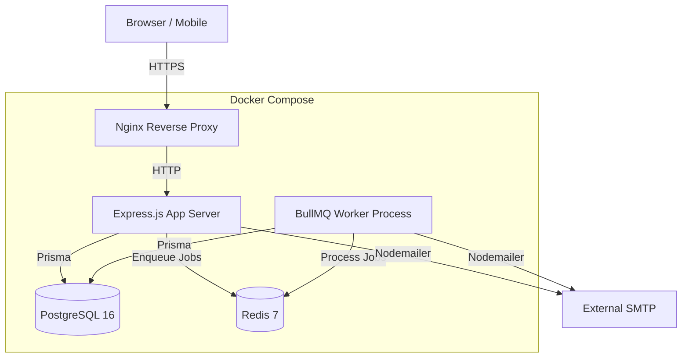
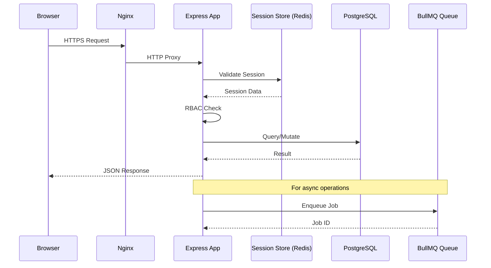
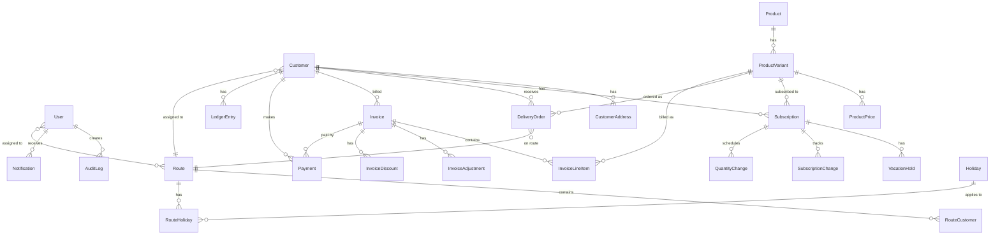
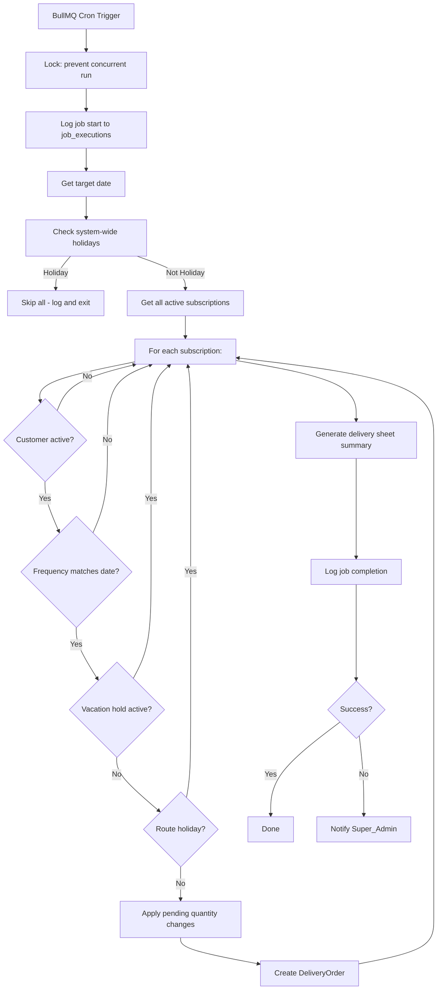
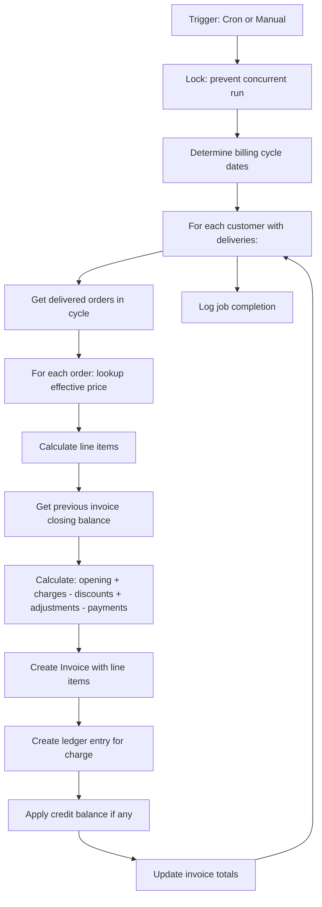
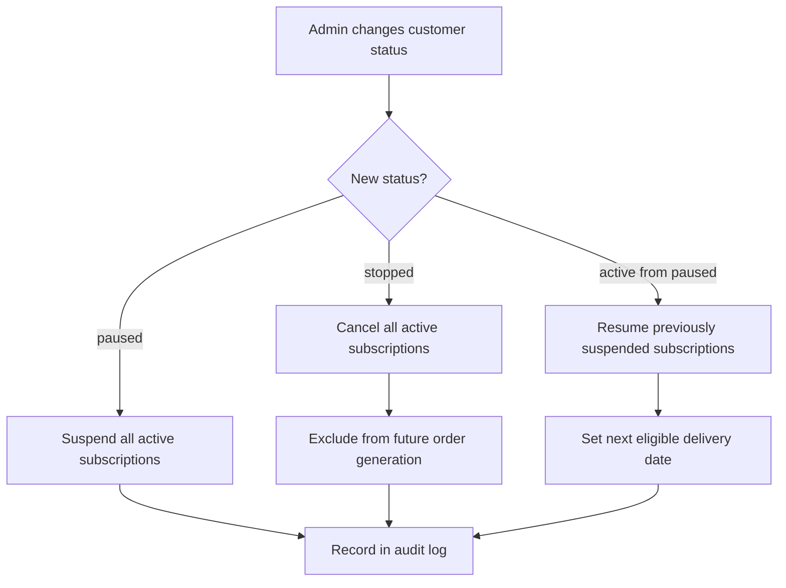
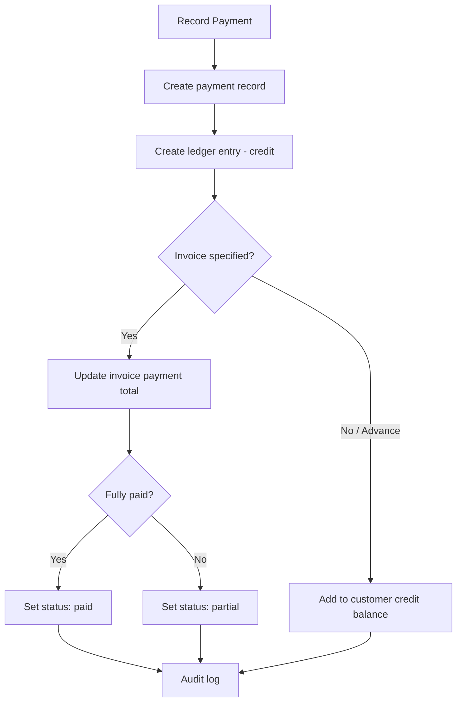

# Design Document: Milk Delivery Platform

## Overview

The Milk Delivery Platform is a self-hosted, open-source web application for managing the full lifecycle of a milk/dairy delivery business. It covers customer onboarding, product catalog, recurring subscriptions, daily delivery operations, route management, billing, payment collection, reporting, and administration.

### Stack Selection

| Layer | Technology | Justification |
|---|---|---|
| Backend Runtime | Node.js 20 LTS | Large ecosystem, single-language fullstack, excellent Docker support |
| Backend Framework | Express.js | Minimal, battle-tested, huge middleware ecosystem |
| ORM / Query Builder | Prisma | Type-safe schema, auto-generated migrations, excellent PostgreSQL support |
| Database | PostgreSQL 16 | Required by spec. Best open-source RDBMS for relational data |
| Background Jobs | BullMQ + Redis | Open-source, reliable job scheduling with cron, retries, concurrency control |
| Frontend | React 18 + Vite | Component model fits CRUD-heavy UI, Vite for fast builds |
| UI Components | Shadcn/ui + Tailwind CSS | Open-source, accessible (ARIA), responsive, no paid dependencies |
| PDF Generation | PDFKit | Pure JS, no external services, MIT licensed |
| Email | Nodemailer | Standard Node.js SMTP client, zero paid dependencies |
| Auth | express-session + passport-local | Session-based auth, bcrypt password hashing, CSRF via csurf |
| Testing | Vitest + fast-check | Vitest for unit/integration, fast-check for property-based testing |
| Containerization | Docker + docker-compose | Single-server deployment as required |
| Reverse Proxy | Nginx (in Docker) | HTTPS termination, static file serving |

### Key Design Decisions

1. **Monolithic architecture** — Single Express.js server serves both API and React SPA. Simpler deployment, debugging, and operations for a single-server target.
2. **Session-based auth over JWT** — Server-side sessions with httpOnly cookies. Easier to invalidate on logout/deactivation. No token refresh complexity.
3. **BullMQ for background jobs** — Redis-backed queue gives us cron scheduling, retry logic, concurrency locks, and job logging. Redis is lightweight and runs in the same Docker Compose stack.
4. **Prisma over raw SQL** — Type-safe queries, auto-generated migrations, seed scripts. Prevents SQL injection by design. Tradeoff: slightly less control over complex queries, mitigated by Prisma's `$queryRaw` escape hatch.
5. **PDFKit over Puppeteer/wkhtmltopdf** — No headless browser dependency. Smaller Docker image. Sufficient for invoice/manifest PDFs.
6. **Shadcn/ui over full component libraries** — Copy-paste components, no runtime dependency, fully customizable, built on Radix (accessible).

### Tradeoffs

| Decision | Benefit | Cost |
|---|---|---|
| Monolith | Simple deployment, single process | Harder to scale individual modules later |
| Session auth | Easy invalidation, no token leaks | Requires sticky sessions if ever load-balanced |
| BullMQ + Redis | Reliable scheduling, retries | Extra container (Redis) in Docker Compose |
| Prisma | Type safety, migrations | Learning curve, some complex queries need raw SQL |
| PDFKit | No browser dependency | More code for complex layouts vs HTML-to-PDF |
| Single DB | Simple operations | All data in one PostgreSQL instance |

## Architecture

### High-Level Architecture



### Request Flow



### Module Boundaries

The monolith is organized into logical modules with clear boundaries:

```
src/
├── server/
│   ├── modules/
│   │   ├── auth/           # Authentication, sessions, CSRF
│   │   ├── users/          # Staff account CRUD, role management
│   │   ├── customers/      # Customer profiles, addresses, status
│   │   ├── products/       # Products, variants, pricing
│   │   ├── subscriptions/  # Subscription CRUD, vacation holds, changes
│   │   ├── orders/         # Daily order generation, delivery sheets
│   │   ├── delivery/       # Delivery operations, status marking
│   │   ├── routes/         # Route CRUD, customer assignment, sequencing
│   │   ├── billing/        # Invoice generation, adjustments, discounts
│   │   ├── payments/       # Payment recording, collections, reconciliation
│   │   ├── ledger/         # Customer ledger, financial history
│   │   ├── reports/        # All report queries and CSV export
│   │   ├── notifications/  # Dashboard alerts, email dispatch
│   │   ├── audit/          # Audit log recording and querying
│   │   ├── holidays/       # Holiday calendar, route exceptions
│   │   ├── inventory/      # Post-MVP: stock tracking
│   │   ├── export/         # PDF generation, CSV export, print layouts
│   │   └── settings/       # System configuration (billing cycle, cutoff, etc.)
│   ├── middleware/          # Auth, RBAC, CSRF, rate-limit, validation
│   ├── jobs/               # BullMQ job definitions and processors
│   ├── lib/                # Shared utilities (pdf, email, pagination)
│   └── index.ts            # Express app entry point
├── client/                 # React SPA (Vite)
│   ├── pages/
│   ├── components/
│   ├── hooks/
│   ├── lib/
│   └── main.tsx
├── prisma/
│   ├── schema.prisma
│   ├── migrations/
│   └── seed.ts
├── docker-compose.yml
├── Dockerfile
├── .env.example
└── README.md
```

Each module follows a consistent internal structure:

```
modules/{name}/
├── {name}.routes.ts      # Express router with endpoint definitions
├── {name}.controller.ts  # Request handling, validation, response
├── {name}.service.ts     # Business logic, Prisma queries
├── {name}.types.ts       # TypeScript interfaces and Zod schemas
└── {name}.test.ts        # Unit and property tests
```

## Components and Interfaces

### API Endpoints

All endpoints are prefixed with `/api/v1`. Authentication required unless noted.

#### Auth Module
| Method | Path | Role | Description |
|---|---|---|---|
| POST | /auth/login | Public | Authenticate with credentials |
| POST | /auth/logout | Any | Invalidate session |
| GET | /auth/me | Any | Get current user info |

#### Users Module
| Method | Path | Role | Description |
|---|---|---|---|
| GET | /users | Super_Admin | List staff accounts (paginated) |
| POST | /users | Super_Admin | Create staff account |
| PUT | /users/:id | Super_Admin | Update staff account / assign role |
| PATCH | /users/:id/deactivate | Super_Admin | Deactivate account, kill sessions |

#### Customers Module
| Method | Path | Role | Description |
|---|---|---|---|
| GET | /customers | Admin+ | List customers (paginated, filterable) |
| GET | /customers/:id | Admin+ | Get customer detail |
| POST | /customers | Admin | Create customer |
| PUT | /customers/:id | Admin | Update customer |
| PATCH | /customers/:id/status | Admin | Change status (active/paused/stopped) |
| GET | /customers/:id/addresses | Admin+ | List addresses |
| POST | /customers/:id/addresses | Admin | Add address |
| PUT | /customers/:id/addresses/:addrId | Admin | Update address |
| GET | /customers/:id/ledger | Admin, Billing_Staff | Get customer ledger |
| GET | /customers/:id/ledger/pdf | Admin, Billing_Staff | Download ledger PDF |

#### Products Module
| Method | Path | Role | Description |
|---|---|---|---|
| GET | /products | Admin+ | List products |
| POST | /products | Admin | Create product |
| PUT | /products/:id | Admin | Update product |
| GET | /products/:id/variants | Admin+ | List variants |
| POST | /products/:id/variants | Admin | Create variant |
| PUT | /products/:id/variants/:vid | Admin | Update variant |
| POST | /products/:id/variants/:vid/prices | Admin | Add price entry |
| GET | /products/:id/variants/:vid/prices | Admin+ | Get price history |

#### Subscriptions Module
| Method | Path | Role | Description |
|---|---|---|---|
| GET | /subscriptions | Admin+ | List subscriptions (filterable) |
| POST | /subscriptions | Admin | Create subscription |
| PUT | /subscriptions/:id | Admin | Update subscription |
| PATCH | /subscriptions/:id/cancel | Admin | Cancel subscription |
| POST | /subscriptions/:id/vacation-holds | Admin | Create vacation hold |
| PATCH | /subscriptions/:id/vacation-holds/:hid/resume | Admin | Resume from hold early |
| POST | /subscriptions/:id/quantity-changes | Admin | Schedule quantity change |
| GET | /subscriptions/:id/history | Admin+ | Get change history |

#### Orders Module
| Method | Path | Role | Description |
|---|---|---|---|
| GET | /orders?date=YYYY-MM-DD | Admin+ | Get delivery sheet for date |
| POST | /orders | Admin | Add one-time order |
| PUT | /orders/:id | Admin | Modify order before delivery |
| DELETE | /orders/:id | Admin | Remove order before delivery |
| POST | /orders/generate | Super_Admin | Manually trigger daily generation |
| GET | /orders/summary?date=YYYY-MM-DD | Admin+ | Delivery sheet summary |

#### Delivery Module
| Method | Path | Role | Description |
|---|---|---|---|
| GET | /delivery/manifest?date=YYYY-MM-DD | Delivery_Agent+ | Get agent's route manifest |
| PATCH | /delivery/orders/:id/status | Delivery_Agent | Mark delivery status |
| PATCH | /delivery/orders/:id/notes | Delivery_Agent | Add delivery notes |
| GET | /delivery/reconciliation?date=YYYY-MM-DD | Delivery_Agent+ | End-of-day summary |
| GET | /delivery/overview?date=YYYY-MM-DD | Admin | All routes/agents status |

#### Routes Module
| Method | Path | Role | Description |
|---|---|---|---|
| GET | /routes | Admin+ | List routes |
| POST | /routes | Admin | Create route |
| PUT | /routes/:id | Admin | Update route |
| PATCH | /routes/:id/deactivate | Admin | Deactivate route |
| PUT | /routes/:id/customers | Admin | Assign/reorder customers |
| PUT | /routes/:id/agents | Admin | Assign agents |
| GET | /routes/:id/manifest?date=YYYY-MM-DD | Admin+ | Route manifest |
| GET | /routes/:id/manifest/print?date=YYYY-MM-DD | Admin+ | Printable manifest |
| GET | /routes/:id/summary | Admin+ | Route summary stats |

#### Billing Module
| Method | Path | Role | Description |
|---|---|---|---|
| POST | /billing/generate | Billing_Staff, Super_Admin | Generate invoices for cycle |
| GET | /billing/invoices | Admin, Billing_Staff | List invoices (filterable) |
| GET | /billing/invoices/:id | Admin, Billing_Staff | Invoice detail |
| GET | /billing/invoices/:id/pdf | Admin, Billing_Staff | Download invoice PDF |
| POST | /billing/invoices/:id/adjustments | Billing_Staff | Add adjustment |
| POST | /billing/invoices/:id/discounts | Billing_Staff | Add discount |
| POST | /billing/invoices/:id/regenerate | Billing_Staff | Regenerate invoice |

#### Payments Module
| Method | Path | Role | Description |
|---|---|---|---|
| POST | /payments | Billing_Staff | Record payment |
| POST | /payments/collections | Delivery_Agent | Record field collection |
| GET | /payments/reconciliation?date=YYYY-MM-DD | Admin | Collection reconciliation |
| GET | /payments/outstanding | Admin, Billing_Staff | Customer outstanding summary |

#### Reports Module
| Method | Path | Role | Description |
|---|---|---|---|
| GET | /reports/daily-delivery | Admin+ | Daily delivery quantities |
| GET | /reports/route-delivery | Admin+ | Route-wise delivery report |
| GET | /reports/outstanding | Admin+ | Customer outstanding report |
| GET | /reports/revenue | Admin+ | Revenue report |
| GET | /reports/product-sales | Admin+ | Product sales report |
| GET | /reports/missed-deliveries | Admin+ | Missed deliveries report |
| GET | /reports/subscription-changes | Admin+ | Subscription audit report |
| GET | /reports/:type/csv | Admin+ | CSV export for any report |

#### Other Modules
| Method | Path | Role | Description |
|---|---|---|---|
| GET | /notifications | Any | Get user notifications |
| PATCH | /notifications/:id/read | Any | Mark notification as read |
| GET | /audit-logs | Super_Admin, Admin | Search audit logs |
| GET | /holidays | Admin+ | List holidays |
| POST | /holidays | Admin | Add holiday |
| DELETE | /holidays/:id | Admin | Remove future holiday |
| GET | /settings | Super_Admin | Get system settings |
| PUT | /settings | Super_Admin | Update system settings |
| GET | /health | Public | Health check |

### Middleware Stack

```
Request → Nginx (HTTPS/proxy) → Express Pipeline:
  1. helmet()              — Security headers
  2. cors()                — CORS configuration
  3. express.json()        — Body parsing
  4. session()             — Session management (Redis store)
  5. csrf()                — CSRF token validation
  6. rateLimiter()         — IP/user rate limiting
  7. authenticate()        — Session validation
  8. authorize(roles[])    — RBAC enforcement
  9. validate(schema)      — Zod request validation
  10. controller()         — Business logic
  11. auditLog()           — Post-response audit recording
  12. errorHandler()       — Centralized error handling
```

### Notification Provider Interface

```typescript
interface NotificationProvider {
  send(recipient: string, subject: string, body: string): Promise<void>;
}

// Implementations:
// - DashboardNotificationProvider (writes to notifications table)
// - EmailNotificationProvider (Nodemailer SMTP)
// - Future: SMSNotificationProvider, WebhookNotificationProvider
```

### Background Job Interfaces

```typescript
// Job definitions
interface DailyOrderGenerationJob {
  targetDate: string; // ISO date
  triggeredBy: 'scheduler' | 'manual';
  userId?: string;    // If manual trigger
}

interface MonthlyInvoiceGenerationJob {
  billingCycleStart: string; // ISO date
  billingCycleEnd: string;   // ISO date
  triggeredBy: 'scheduler' | 'manual';
  userId?: string;
}

// Job result logged to job_executions table
interface JobExecution {
  jobName: string;
  startedAt: Date;
  completedAt: Date;
  status: 'success' | 'failure';
  recordsProcessed: number;
  errorMessage?: string;
}
```

## Data Models

### Entity Relationship Diagram



### Database Schema

#### Core Identity Tables

```sql
-- Staff users (not customers)
CREATE TABLE users (
    id UUID PRIMARY KEY DEFAULT gen_random_uuid(),
    email VARCHAR(255) UNIQUE NOT NULL,
    password_hash VARCHAR(255) NOT NULL,
    name VARCHAR(255) NOT NULL,
    role VARCHAR(50) NOT NULL CHECK (role IN ('super_admin', 'admin', 'delivery_agent', 'billing_staff', 'read_only')),
    is_active BOOLEAN NOT NULL DEFAULT true,
    failed_login_attempts INTEGER NOT NULL DEFAULT 0,
    locked_until TIMESTAMP WITH TIME ZONE,
    last_login_at TIMESTAMP WITH TIME ZONE,
    created_at TIMESTAMP WITH TIME ZONE NOT NULL DEFAULT NOW(),
    updated_at TIMESTAMP WITH TIME ZONE NOT NULL DEFAULT NOW()
);

-- Customers (delivery recipients)
CREATE TABLE customers (
    id UUID PRIMARY KEY DEFAULT gen_random_uuid(),
    name VARCHAR(255) NOT NULL,
    phone VARCHAR(20) UNIQUE NOT NULL,
    email VARCHAR(255),
    status VARCHAR(20) NOT NULL DEFAULT 'active' CHECK (status IN ('active', 'paused', 'stopped')),
    delivery_notes TEXT,
    preferred_delivery_window VARCHAR(50),
    route_id UUID REFERENCES routes(id),
    created_at TIMESTAMP WITH TIME ZONE NOT NULL DEFAULT NOW(),
    updated_at TIMESTAMP WITH TIME ZONE NOT NULL DEFAULT NOW()
);

CREATE TABLE customer_addresses (
    id UUID PRIMARY KEY DEFAULT gen_random_uuid(),
    customer_id UUID NOT NULL REFERENCES customers(id) ON DELETE CASCADE,
    address_line1 VARCHAR(500) NOT NULL,
    address_line2 VARCHAR(500),
    city VARCHAR(100),
    state VARCHAR(100),
    pincode VARCHAR(10),
    latitude DECIMAL(10, 8),
    longitude DECIMAL(11, 8),
    is_primary BOOLEAN NOT NULL DEFAULT false,
    created_at TIMESTAMP WITH TIME ZONE NOT NULL DEFAULT NOW(),
    updated_at TIMESTAMP WITH TIME ZONE NOT NULL DEFAULT NOW()
);
```

#### Product Tables

```sql
CREATE TABLE products (
    id UUID PRIMARY KEY DEFAULT gen_random_uuid(),
    name VARCHAR(255) NOT NULL,
    category VARCHAR(100),
    description TEXT,
    is_active BOOLEAN NOT NULL DEFAULT true,
    created_at TIMESTAMP WITH TIME ZONE NOT NULL DEFAULT NOW(),
    updated_at TIMESTAMP WITH TIME ZONE NOT NULL DEFAULT NOW()
);

CREATE TABLE product_variants (
    id UUID PRIMARY KEY DEFAULT gen_random_uuid(),
    product_id UUID NOT NULL REFERENCES products(id) ON DELETE CASCADE,
    unit_type VARCHAR(50) NOT NULL CHECK (unit_type IN ('liters', 'milliliters', 'packets', 'kilograms', 'pieces')),
    quantity_per_unit DECIMAL(10, 3) NOT NULL,
    sku VARCHAR(100) UNIQUE,
    is_active BOOLEAN NOT NULL DEFAULT true,
    created_at TIMESTAMP WITH TIME ZONE NOT NULL DEFAULT NOW(),
    updated_at TIMESTAMP WITH TIME ZONE NOT NULL DEFAULT NOW()
);

CREATE TABLE product_prices (
    id UUID PRIMARY KEY DEFAULT gen_random_uuid(),
    product_variant_id UUID NOT NULL REFERENCES product_variants(id) ON DELETE CASCADE,
    price DECIMAL(10, 2) NOT NULL,
    effective_date DATE NOT NULL,
    branch VARCHAR(100), -- NULL = default price, non-null = branch override
    created_at TIMESTAMP WITH TIME ZONE NOT NULL DEFAULT NOW(),
    UNIQUE(product_variant_id, effective_date, branch)
);
CREATE INDEX idx_product_prices_lookup ON product_prices(product_variant_id, effective_date DESC);
```

#### Subscription Tables

```sql
CREATE TABLE subscriptions (
    id UUID PRIMARY KEY DEFAULT gen_random_uuid(),
    customer_id UUID NOT NULL REFERENCES customers(id),
    product_variant_id UUID NOT NULL REFERENCES product_variants(id),
    quantity DECIMAL(10, 3) NOT NULL,
    frequency_type VARCHAR(20) NOT NULL CHECK (frequency_type IN ('daily', 'alternate_day', 'custom_weekday')),
    weekdays INTEGER[], -- For custom_weekday: array of 0-6 (Sun-Sat)
    start_date DATE NOT NULL,
    end_date DATE, -- NULL = ongoing, set on cancellation
    status VARCHAR(20) NOT NULL DEFAULT 'active' CHECK (status IN ('active', 'paused', 'cancelled')),
    created_at TIMESTAMP WITH TIME ZONE NOT NULL DEFAULT NOW(),
    updated_at TIMESTAMP WITH TIME ZONE NOT NULL DEFAULT NOW()
);

CREATE TABLE vacation_holds (
    id UUID PRIMARY KEY DEFAULT gen_random_uuid(),
    subscription_id UUID NOT NULL REFERENCES subscriptions(id) ON DELETE CASCADE,
    start_date DATE NOT NULL,
    end_date DATE NOT NULL,
    resumed_at DATE, -- NULL = still on hold, set if resumed early
    created_by UUID NOT NULL REFERENCES users(id),
    created_at TIMESTAMP WITH TIME ZONE NOT NULL DEFAULT NOW()
);

CREATE TABLE quantity_changes (
    id UUID PRIMARY KEY DEFAULT gen_random_uuid(),
    subscription_id UUID NOT NULL REFERENCES subscriptions(id) ON DELETE CASCADE,
    new_quantity DECIMAL(10, 3) NOT NULL,
    effective_date DATE NOT NULL,
    applied BOOLEAN NOT NULL DEFAULT false,
    created_by UUID NOT NULL REFERENCES users(id),
    created_at TIMESTAMP WITH TIME ZONE NOT NULL DEFAULT NOW()
);

CREATE TABLE subscription_changes (
    id UUID PRIMARY KEY DEFAULT gen_random_uuid(),
    subscription_id UUID NOT NULL REFERENCES subscriptions(id) ON DELETE CASCADE,
    change_type VARCHAR(50) NOT NULL, -- 'created', 'quantity_changed', 'paused', 'resumed', 'cancelled', 'vacation_hold', 'vacation_resume'
    old_value TEXT,
    new_value TEXT,
    changed_by UUID NOT NULL REFERENCES users(id),
    created_at TIMESTAMP WITH TIME ZONE NOT NULL DEFAULT NOW()
);
```

#### Delivery Tables

```sql
CREATE TABLE delivery_orders (
    id UUID PRIMARY KEY DEFAULT gen_random_uuid(),
    customer_id UUID NOT NULL REFERENCES customers(id),
    product_variant_id UUID NOT NULL REFERENCES product_variants(id),
    subscription_id UUID REFERENCES subscriptions(id), -- NULL for one-time orders
    route_id UUID REFERENCES routes(id),
    delivery_date DATE NOT NULL,
    quantity DECIMAL(10, 3) NOT NULL,
    status VARCHAR(20) NOT NULL DEFAULT 'pending' CHECK (status IN ('pending', 'delivered', 'skipped', 'failed', 'returned')),
    skip_reason VARCHAR(50), -- 'customer_absent', 'customer_refused', 'access_issue', 'other'
    failure_reason TEXT,
    returned_quantity DECIMAL(10, 3),
    delivery_notes TEXT,
    delivered_by UUID REFERENCES users(id),
    delivered_at TIMESTAMP WITH TIME ZONE,
    is_auto_generated BOOLEAN NOT NULL DEFAULT true,
    created_at TIMESTAMP WITH TIME ZONE NOT NULL DEFAULT NOW(),
    updated_at TIMESTAMP WITH TIME ZONE NOT NULL DEFAULT NOW()
);
CREATE INDEX idx_delivery_orders_date ON delivery_orders(delivery_date);
CREATE INDEX idx_delivery_orders_customer_date ON delivery_orders(customer_id, delivery_date);
CREATE INDEX idx_delivery_orders_route_date ON delivery_orders(route_id, delivery_date);
CREATE UNIQUE INDEX idx_delivery_orders_unique ON delivery_orders(subscription_id, delivery_date) WHERE subscription_id IS NOT NULL;
```

#### Route Tables

```sql
CREATE TABLE routes (
    id UUID PRIMARY KEY DEFAULT gen_random_uuid(),
    name VARCHAR(255) NOT NULL,
    description TEXT,
    is_active BOOLEAN NOT NULL DEFAULT true,
    created_at TIMESTAMP WITH TIME ZONE NOT NULL DEFAULT NOW(),
    updated_at TIMESTAMP WITH TIME ZONE NOT NULL DEFAULT NOW()
);

CREATE TABLE route_customers (
    id UUID PRIMARY KEY DEFAULT gen_random_uuid(),
    route_id UUID NOT NULL REFERENCES routes(id) ON DELETE CASCADE,
    customer_id UUID NOT NULL REFERENCES customers(id),
    sequence_order INTEGER NOT NULL,
    UNIQUE(route_id, customer_id),
    UNIQUE(route_id, sequence_order)
);

CREATE TABLE route_agents (
    id UUID PRIMARY KEY DEFAULT gen_random_uuid(),
    route_id UUID NOT NULL REFERENCES routes(id) ON DELETE CASCADE,
    user_id UUID NOT NULL REFERENCES users(id),
    UNIQUE(route_id, user_id)
);
```

#### Billing Tables

```sql
CREATE TABLE invoices (
    id UUID PRIMARY KEY DEFAULT gen_random_uuid(),
    customer_id UUID NOT NULL REFERENCES customers(id),
    billing_cycle_start DATE NOT NULL,
    billing_cycle_end DATE NOT NULL,
    version INTEGER NOT NULL DEFAULT 1,
    opening_balance DECIMAL(12, 2) NOT NULL DEFAULT 0,
    total_charges DECIMAL(12, 2) NOT NULL DEFAULT 0,
    total_discounts DECIMAL(12, 2) NOT NULL DEFAULT 0,
    total_adjustments DECIMAL(12, 2) NOT NULL DEFAULT 0,
    total_payments DECIMAL(12, 2) NOT NULL DEFAULT 0,
    closing_balance DECIMAL(12, 2) NOT NULL DEFAULT 0,
    payment_status VARCHAR(20) NOT NULL DEFAULT 'unpaid' CHECK (payment_status IN ('unpaid', 'partial', 'paid')),
    is_current BOOLEAN NOT NULL DEFAULT true, -- false for superseded versions
    generated_at TIMESTAMP WITH TIME ZONE NOT NULL DEFAULT NOW(),
    created_at TIMESTAMP WITH TIME ZONE NOT NULL DEFAULT NOW(),
    updated_at TIMESTAMP WITH TIME ZONE NOT NULL DEFAULT NOW()
);

CREATE TABLE invoice_line_items (
    id UUID PRIMARY KEY DEFAULT gen_random_uuid(),
    invoice_id UUID NOT NULL REFERENCES invoices(id) ON DELETE CASCADE,
    delivery_order_id UUID NOT NULL REFERENCES delivery_orders(id),
    product_variant_id UUID NOT NULL REFERENCES product_variants(id),
    delivery_date DATE NOT NULL,
    quantity DECIMAL(10, 3) NOT NULL,
    unit_price DECIMAL(10, 2) NOT NULL,
    line_total DECIMAL(12, 2) NOT NULL,
    created_at TIMESTAMP WITH TIME ZONE NOT NULL DEFAULT NOW()
);

CREATE TABLE invoice_adjustments (
    id UUID PRIMARY KEY DEFAULT gen_random_uuid(),
    invoice_id UUID NOT NULL REFERENCES invoices(id) ON DELETE CASCADE,
    adjustment_type VARCHAR(10) NOT NULL CHECK (adjustment_type IN ('credit', 'debit')),
    amount DECIMAL(12, 2) NOT NULL,
    reason TEXT NOT NULL,
    created_by UUID NOT NULL REFERENCES users(id),
    created_at TIMESTAMP WITH TIME ZONE NOT NULL DEFAULT NOW()
);

CREATE TABLE invoice_discounts (
    id UUID PRIMARY KEY DEFAULT gen_random_uuid(),
    invoice_id UUID NOT NULL REFERENCES invoices(id) ON DELETE CASCADE,
    discount_type VARCHAR(20) NOT NULL CHECK (discount_type IN ('percentage', 'fixed')),
    value DECIMAL(10, 2) NOT NULL, -- percentage value or fixed amount
    amount DECIMAL(12, 2) NOT NULL, -- calculated discount amount
    description TEXT,
    created_by UUID NOT NULL REFERENCES users(id),
    created_at TIMESTAMP WITH TIME ZONE NOT NULL DEFAULT NOW()
);
```

#### Payment Tables

```sql
CREATE TABLE payments (
    id UUID PRIMARY KEY DEFAULT gen_random_uuid(),
    customer_id UUID NOT NULL REFERENCES customers(id),
    invoice_id UUID REFERENCES invoices(id), -- NULL for advance payments
    amount DECIMAL(12, 2) NOT NULL,
    payment_method VARCHAR(20) NOT NULL CHECK (payment_method IN ('cash', 'upi', 'bank_transfer', 'card', 'other')),
    payment_method_description TEXT, -- For 'other' method
    payment_date DATE NOT NULL,
    collected_by UUID REFERENCES users(id), -- Delivery agent for field collections
    is_field_collection BOOLEAN NOT NULL DEFAULT false,
    recorded_by UUID NOT NULL REFERENCES users(id),
    created_at TIMESTAMP WITH TIME ZONE NOT NULL DEFAULT NOW()
);
```

#### Ledger Table

```sql
CREATE TABLE ledger_entries (
    id UUID PRIMARY KEY DEFAULT gen_random_uuid(),
    customer_id UUID NOT NULL REFERENCES customers(id),
    entry_date DATE NOT NULL,
    transaction_type VARCHAR(20) NOT NULL CHECK (transaction_type IN ('charge', 'payment', 'adjustment', 'credit_applied')),
    reference_type VARCHAR(20), -- 'invoice', 'payment', 'adjustment'
    reference_id UUID,
    debit_amount DECIMAL(12, 2) NOT NULL DEFAULT 0,
    credit_amount DECIMAL(12, 2) NOT NULL DEFAULT 0,
    running_balance DECIMAL(12, 2) NOT NULL,
    description TEXT,
    created_at TIMESTAMP WITH TIME ZONE NOT NULL DEFAULT NOW()
);
CREATE INDEX idx_ledger_customer_date ON ledger_entries(customer_id, entry_date);
```

#### Holiday and System Tables

```sql
CREATE TABLE holidays (
    id UUID PRIMARY KEY DEFAULT gen_random_uuid(),
    holiday_date DATE NOT NULL,
    description VARCHAR(255),
    is_system_wide BOOLEAN NOT NULL DEFAULT true,
    created_by UUID NOT NULL REFERENCES users(id),
    created_at TIMESTAMP WITH TIME ZONE NOT NULL DEFAULT NOW()
);

CREATE TABLE route_holidays (
    id UUID PRIMARY KEY DEFAULT gen_random_uuid(),
    route_id UUID NOT NULL REFERENCES routes(id) ON DELETE CASCADE,
    holiday_date DATE NOT NULL,
    description VARCHAR(255),
    created_by UUID NOT NULL REFERENCES users(id),
    created_at TIMESTAMP WITH TIME ZONE NOT NULL DEFAULT NOW(),
    UNIQUE(route_id, holiday_date)
);

CREATE TABLE audit_logs (
    id UUID PRIMARY KEY DEFAULT gen_random_uuid(),
    user_id UUID NOT NULL REFERENCES users(id),
    user_role VARCHAR(50) NOT NULL,
    action_type VARCHAR(20) NOT NULL CHECK (action_type IN ('create', 'update', 'delete')),
    entity_type VARCHAR(50) NOT NULL,
    entity_id UUID NOT NULL,
    changes JSONB, -- {field: {old: value, new: value}}
    created_at TIMESTAMP WITH TIME ZONE NOT NULL DEFAULT NOW()
);
CREATE INDEX idx_audit_logs_entity ON audit_logs(entity_type, entity_id);
CREATE INDEX idx_audit_logs_user ON audit_logs(user_id);
CREATE INDEX idx_audit_logs_created ON audit_logs(created_at);

CREATE TABLE notifications (
    id UUID PRIMARY KEY DEFAULT gen_random_uuid(),
    user_id UUID NOT NULL REFERENCES users(id),
    title VARCHAR(255) NOT NULL,
    body TEXT NOT NULL,
    event_type VARCHAR(50) NOT NULL,
    is_read BOOLEAN NOT NULL DEFAULT false,
    created_at TIMESTAMP WITH TIME ZONE NOT NULL DEFAULT NOW()
);
CREATE INDEX idx_notifications_user ON notifications(user_id, is_read, created_at DESC);

CREATE TABLE system_settings (
    key VARCHAR(100) PRIMARY KEY,
    value JSONB NOT NULL,
    updated_by UUID REFERENCES users(id),
    updated_at TIMESTAMP WITH TIME ZONE NOT NULL DEFAULT NOW()
);

CREATE TABLE job_executions (
    id UUID PRIMARY KEY DEFAULT gen_random_uuid(),
    job_name VARCHAR(100) NOT NULL,
    started_at TIMESTAMP WITH TIME ZONE NOT NULL,
    completed_at TIMESTAMP WITH TIME ZONE,
    status VARCHAR(20) NOT NULL CHECK (status IN ('running', 'success', 'failure')),
    records_processed INTEGER DEFAULT 0,
    error_message TEXT,
    triggered_by VARCHAR(20) NOT NULL CHECK (triggered_by IN ('scheduler', 'manual')),
    user_id UUID REFERENCES users(id),
    created_at TIMESTAMP WITH TIME ZONE NOT NULL DEFAULT NOW()
);
```

#### Post-MVP: Inventory Tables

```sql
CREATE TABLE inventory_entries (
    id UUID PRIMARY KEY DEFAULT gen_random_uuid(),
    product_variant_id UUID NOT NULL REFERENCES product_variants(id),
    entry_date DATE NOT NULL,
    entry_type VARCHAR(20) NOT NULL CHECK (entry_type IN ('opening', 'inward', 'wastage')),
    quantity DECIMAL(10, 3) NOT NULL,
    supplier_name VARCHAR(255), -- For inward entries
    reason TEXT, -- For wastage entries
    recorded_by UUID NOT NULL REFERENCES users(id),
    created_at TIMESTAMP WITH TIME ZONE NOT NULL DEFAULT NOW()
);
```

### Key Workflows

#### Daily Order Generation Workflow



#### Monthly Invoice Generation Workflow



#### Customer Status Change Workflow



#### Payment Recording Workflow


