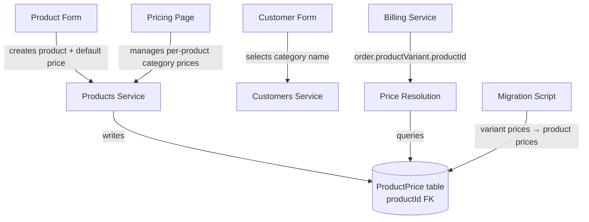

# Design Document: Product-Level Pricing

## Overview

This feature restructures the pricing model from variant-level to product-level. Currently, `ProductPrice` records reference `productVariantId`, meaning each variant (e.g. "Buffalo Milk - 1 liter") has its own price. The new model links prices to `productId` (e.g. "Buffalo Milk"), so all variants of a product share the same price. This simplifies pricing management, reduces redundancy, and aligns with the business reality that pricing tiers apply to products, not unit configurations.

### Key Changes
- `ProductPrice.productVariantId` → `ProductPrice.productId`
- `getEffectivePrice(variantId, ...)` → `getEffectivePrice(productId, ...)`
- Pricing page shows one row per product instead of one per variant
- Product creation form requires a default price
- Customer form dropdown shows category names only (no prices)
- Billing resolves price by navigating from variant → product → price
- Migration script converts existing variant-level prices to product-level

## Architecture

The change is primarily a data model refactoring with cascading effects across the stack:



### Affected Layers

1. **Database**: Prisma schema — `ProductPrice` FK change, unique constraint update, index update
2. **Backend Service**: `pricing.ts` — `getEffectivePrice` signature change
3. **Backend Service**: `products.service.ts` — `createProduct` creates default price, `addPrice` links to product, `getPricingMatrix` groups by product
4. **Backend Service**: `billing.service.ts` — resolve `productId` from `order.productVariant.productId`
5. **Frontend**: `ProductFormPage.tsx` — add default price field
6. **Frontend**: `PricingPage.tsx` — one row per product
7. **Frontend**: `CustomerFormPage.tsx` — remove price preview, show category names only
8. **Migration**: Prisma migration + data migration script

## Components and Interfaces

### 1. Prisma Schema Changes (`prisma/schema.prisma`)

```prisma
model ProductPrice {
  id              String   @id @default(dbgenerated("gen_random_uuid()")) @db.Uuid
  productId       String   @map("product_id") @db.Uuid
  price           Decimal  @db.Decimal(10, 2)
  effectiveDate   DateTime @map("effective_date") @db.Date
  branch          String?  @db.VarChar(100)
  pricingCategory String?  @map("pricing_category") @db.VarChar(100)
  createdAt       DateTime @default(now()) @map("created_at") @db.Timestamptz

  product Product @relation(fields: [productId], references: [id], onDelete: Cascade)

  @@unique([productId, effectiveDate, branch, pricingCategory], map: "uq_product_prices_product_date_branch_category")
  @@index([productId, effectiveDate(sort: Desc), pricingCategory], map: "idx_product_prices_lookup")
  @@map("product_prices")
}
```

The `Product` model gains a `prices ProductPrice[]` relation. The `ProductVariant` model loses its `prices` relation.

### 2. Price Resolution (`src/server/lib/pricing.ts`)

```typescript
export async function getEffectivePrice(
  productId: string,
  targetDate: Date,
  branch?: string | null,
  pricingCategory?: string | null,
): Promise<ProductPrice>
```

Same 4-step fallback logic, but queries `productId` instead of `productVariantId`:
1. branch + pricingCategory
2. branch + null category
3. null branch + pricingCategory
4. null branch + null category

Error message changes to reference product instead of variant.

### 3. Products Service (`src/server/modules/products/products.service.ts`)

**`createProduct`** — accepts `defaultPrice: number` in input. Creates the `Product` record and a `ProductPrice` record with `pricingCategory: null`, `branch: null`, `effectiveDate: today`.

**`updateProduct`** — accepts optional `defaultPrice: number`. If provided, creates a new `ProductPrice` record (new effective date entry) for the default price.

**`addPrice`** — changes signature from `(productId, variantId, input)` to `(productId, input)`. Creates `ProductPrice` linked to `productId`. If `input.pricingCategory` is provided and the `PricingCategory` doesn't exist, creates it.

**`getPricingMatrix`** — returns one row per active `Product` (not per variant). Each row includes the product's default price and category-specific prices.

### 4. Billing Service (`src/server/modules/billing/billing.service.ts`)

When building invoice line items, the service currently calls:
```typescript
getEffectivePrice(order.productVariantId, order.deliveryDate, null, customer.pricingCategory)
```

This changes to:
```typescript
getEffectivePrice(order.productVariant.productId, order.deliveryDate, null, customer.pricingCategory)
```

The `deliveredOrders` query already includes `productVariant`, so we access `productVariant.productId` to get the parent product.

### 5. Product Form (`src/client/pages/products/ProductFormPage.tsx`)

- Add a `defaultPrice` field (required, positive decimal) to the create form
- On edit, display current default price and allow updating
- Price management on variants is removed (prices are now per-product)

### 6. Pricing Page (`src/client/pages/products/PricingPage.tsx`)

- Table shows one row per product (not per variant)
- Each row: product name, default price "(default)", category price columns
- "Add Pricing Variant" button opens a form: product dropdown + category name + price
- Search filters by product name

### 7. Customer Form (`src/client/pages/customers/CustomerFormPage.tsx`)

- Pricing category dropdown shows only category names (e.g. "Cat 1", "Cat 2")
- Add a "Default" option representing null pricing category
- Remove the price preview table (prices are product-specific, not meaningful without knowing which products the customer subscribes to)

### 8. Data Migration

A Prisma migration that:
1. Adds `product_id` column to `product_prices`
2. Populates `product_id` from `product_variant.product_id` for existing rows
3. Handles duplicates (same product + date + branch + category) by keeping the price from the earliest-created variant
4. Drops `product_variant_id` column and old constraints
5. Adds new unique constraint and index on `product_id`

## Data Models

### ProductPrice (Updated)

| Field           | Type     | Constraints                          |
|-----------------|----------|--------------------------------------|
| id              | UUID     | PK, auto-generated                   |
| productId       | UUID     | FK → Product, NOT NULL               |
| price           | Decimal  | (10,2), positive                     |
| effectiveDate   | Date     | NOT NULL                             |
| branch          | String?  | nullable, max 100                    |
| pricingCategory | String?  | nullable, max 100                    |
| createdAt       | DateTime | auto                                 |

**Unique**: `(productId, effectiveDate, branch, pricingCategory)`
**Index**: `(productId, effectiveDate DESC, pricingCategory)`

### CreateProductInput (Updated)

| Field        | Type    | Required |
|--------------|---------|----------|
| name         | string  | yes      |
| category     | string  | no       |
| description  | string  | no       |
| defaultPrice | number  | yes      |

### AddPriceInput (Updated)

| Field           | Type   | Required |
|-----------------|--------|----------|
| productId       | string | yes (from URL param) |
| price           | number | yes      |
| effectiveDate   | string | yes      |
| branch          | string | no       |
| pricingCategory | string | no       |

### PricingMatrix Response (Updated)

```typescript
{
  categories: { id: string; code: string; name: string }[];
  rows: {
    id: string;          // product ID
    name: string;        // product name
    category: string;    // product category
    latestPrices: {
      default: { price: number; effectiveDate: string } | null;
      categories: Record<string, { price: number; effectiveDate: string } | null>;
    };
  }[];
}
```


## Correctness Properties

*A property is a characteristic or behavior that should hold true across all valid executions of a system — essentially, a formal statement about what the system should do. Properties serve as the bridge between human-readable specifications and machine-verifiable correctness guarantees.*

### Property 1: Product creation default price round-trip

*For any* valid product name and positive decimal default price, creating a product should result in a retrievable `ProductPrice` record with the same price, `pricingCategory: null`, `branch: null`, and `effectiveDate` equal to today, linked to the created product's ID.

**Validates: Requirements 1.1, 1.2, 1.4**

### Property 2: Price record unique constraint enforcement

*For any* product, effective date, branch, and pricing category combination, attempting to create two `ProductPrice` records with the same combination should result in the second insert being rejected with a conflict error.

**Validates: Requirements 2.2**

### Property 3: Price record storage round-trip

*For any* valid `ProductPrice` input (positive price, valid date, optional branch, optional pricing category), creating the record and then reading it back should return the same `productId`, `price`, `effectiveDate`, `branch`, and `pricingCategory` values.

**Validates: Requirements 2.3**

### Property 4: Pricing matrix returns one row per active product

*For any* set of active products in the database, the pricing matrix endpoint should return exactly one row per active product, and the number of rows should equal the count of active products.

**Validates: Requirements 3.1**

### Property 5: Pricing matrix search filters by product name

*For any* search string and set of products, the filtered pricing matrix results should contain only products whose name includes the search string (case-insensitive), and should contain all such matching products.

**Validates: Requirements 3.3**

### Property 6: Add pricing variant creates category and price

*For any* active product and category name string, adding a pricing variant should result in both a `PricingCategory` record existing with that name and a `ProductPrice` record linking the product to that category with the specified price.

**Validates: Requirements 4.3**

### Property 7: Price update creates new effective-date entry

*For any* product that already has a price for a given pricing category, adding a new price for the same category should create a new `ProductPrice` record with today's effective date, and `getEffectivePrice` called with today's date should return the new price.

**Validates: Requirements 4.4**

### Property 8: Category listing returns all active categories

*For any* set of pricing categories where some are active and some inactive, the categories API should return exactly the active ones, and the count should match the number of active categories in the database.

**Validates: Requirements 5.1**

### Property 9: Customer pricing category round-trip

*For any* valid pricing category code (including null/empty for "Default"), setting it on a customer record and reading the customer back should return the same pricing category value.

**Validates: Requirements 5.3**

### Property 10: Price resolution fallback order and most-recent-date selection

*For any* product with a set of `ProductPrice` records across various branch/category combinations and effective dates, and a target date, `getEffectivePrice` should:
- Follow the fallback order: (1) branch + category, (2) branch + null category, (3) null branch + category, (4) null branch + null category
- Within the matching fallback step, return the record with the most recent `effectiveDate <= targetDate`
- Never return a record with `effectiveDate > targetDate`

**Validates: Requirements 6.2, 6.4**

### Property 11: Billing resolves price via product from variant

*For any* delivery order with a product variant, the billing service should resolve the price using `productVariant.productId` (not the variant ID itself). The unit price on the resulting invoice line item should equal the effective price for that product on the delivery date with the customer's pricing category.

**Validates: Requirements 7.1**

### Property 12: Migration preserves prices at product level

*For any* set of variant-level `ProductPrice` records, after migration, there should exist a product-level `ProductPrice` record for each unique `(productId, effectiveDate, branch, pricingCategory)` combination, and the `effectiveDate`, `branch`, and `pricingCategory` values should be preserved from the original records.

**Validates: Requirements 8.1, 8.3**

### Property 13: Migration conflict resolution picks earliest variant

*For any* two variants of the same product that have different prices for the same `(effectiveDate, branch, pricingCategory)`, the migration should use the price from the variant with the earlier `createdAt` timestamp as the product-level price.

**Validates: Requirements 8.2**

## Error Handling

| Scenario | Behavior |
|----------|----------|
| Product created without default price | Validation error: "Default price is required" (400) |
| Default price is zero or negative | Validation error: "Price must be positive" (400) |
| Duplicate ProductPrice (same product + date + branch + category) | Conflict error (409) or upsert with new effective date |
| `getEffectivePrice` finds no matching price | `NotFoundError` with message identifying product ID and target date |
| Add pricing variant for non-existent product | `NotFoundError`: "Product not found" (404) |
| Billing encounters variant with no parent product price | `NotFoundError` from price resolution; invoice generation logs error and continues with other customers |
| Migration encounters duplicate product-level price | Skips duplicate, logs warning with details |
| Invalid pricing category code on customer | Validation error if category doesn't exist (400) |

## Testing Strategy

### Unit Tests

Unit tests cover specific examples, edge cases, and integration points:

- Product creation with valid default price creates both Product and ProductPrice records
- Product creation with zero/negative/missing default price is rejected
- Editing a product's default price creates a new ProductPrice entry
- Price resolution returns correct price for each fallback step (specific examples)
- Price resolution throws NotFoundError when no price exists
- Billing correctly navigates variant → product → price for a specific scenario
- Migration handles the case where all variants have the same price (no conflict)
- Migration handles the case where variants have different prices (conflict resolution)
- Customer form saves null pricing category when "Default" is selected

### Property-Based Tests

Property-based tests use `fast-check` (already in the project, see `pricing.test.ts`) with minimum 100 iterations per property.

Each property test must be tagged with a comment:
```
// Feature: product-level-pricing, Property {N}: {title}
```

Key property tests:

1. **Price resolution fallback + most-recent-date** (Property 10): Generate random sets of ProductPrice records with various branch/category/date combinations. Verify the 4-step fallback and most-recent-date selection. This is the highest-value property test — it validates the core pricing logic.

2. **Product creation default price round-trip** (Property 1): Generate random product names and positive prices. Create product, read back, verify default price record exists with correct values.

3. **Migration conflict resolution** (Property 13): Generate random sets of variant prices with overlapping (product, date, branch, category) tuples. Run migration logic, verify the earliest-created variant's price wins.

4. **Pricing matrix one-row-per-product** (Property 4): Generate random sets of products (some active, some inactive). Verify matrix row count equals active product count.

5. **Search filter correctness** (Property 5): Generate random product names and search strings. Verify filtered results match expected set.

6. **Billing price resolution via product** (Property 11): Generate random delivery orders with variants belonging to different products. Verify each line item's unit price matches the effective price for the variant's parent product.

### Test Configuration

- Library: `fast-check` (already a dev dependency)
- Minimum iterations: 100 per property (200 for Property 10 — price resolution)
- Test files: colocated with source (e.g. `pricing.test.ts`, `products.service.test.ts`, `billing.service.test.ts`)
- Each property test references its design document property number
