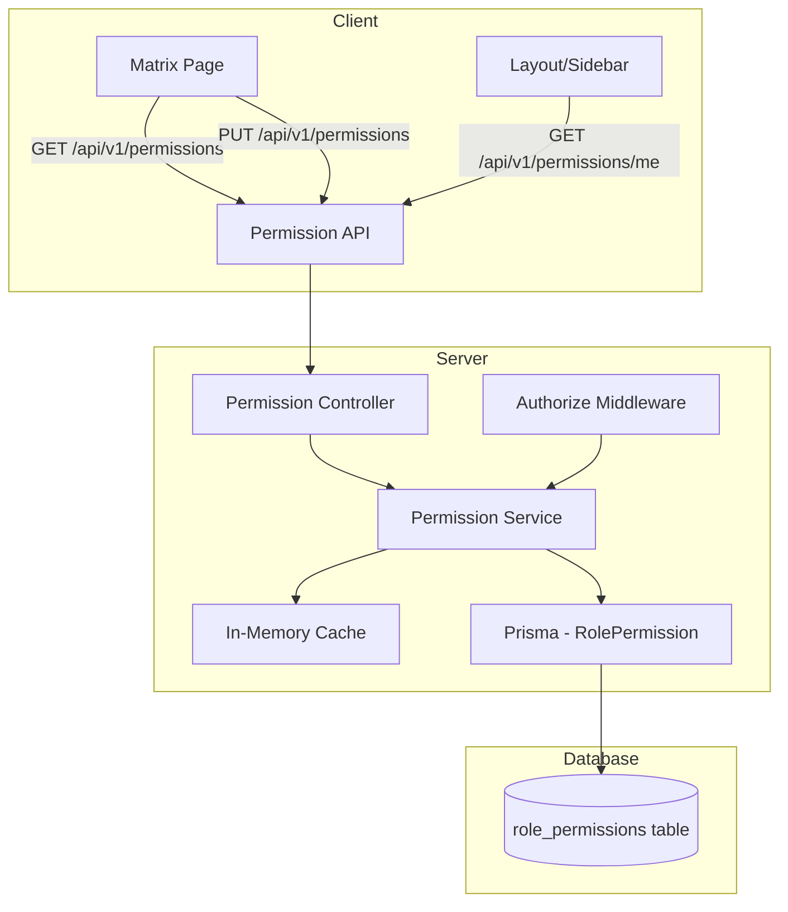

# Design Document: RBAC Permission Matrix

## Overview

This feature replaces the hardcoded role arrays scattered across route files and `Layout.tsx` with a database-driven permission system. A new `RolePermission` Prisma model stores which roles have access to which platform features. The `authorize` middleware is updated to query this table (with in-memory caching), and a super_admin-only UI page provides a checkbox matrix for toggling permissions at runtime.

Key design decisions:
- **In-memory Map cache** (not Redis) for permission lookups — keeps it simple, single-process friendly
- **super_admin bypass** — hardcoded at the middleware level, never stored/checked in DB
- **Permission names** are a fixed set of strings corresponding to platform features (not a DB enum, to allow easy extension)
- **Backward-compatible migration** — a seed script populates the DB with the current hardcoded role arrays so behavior is unchanged on first deploy

## Architecture



**Request flow for a protected route:**
1. Request hits `authenticate` → validates session
2. Request hits `authorize('customers')` → calls `PermissionService.hasPermission(role, 'customers')`
3. PermissionService checks in-memory cache first
4. On cache miss, queries DB, populates cache, returns result
5. super_admin always returns `true` without DB lookup

**Cache invalidation flow:**
1. PUT `/api/v1/permissions` updates DB record
2. Controller calls `PermissionService.invalidateCache()` (clears entire Map)
3. Next request triggers fresh DB load

## Components and Interfaces

### 1. Permission Service (`src/server/modules/permissions/permissions.service.ts`)

```typescript
// Permission names — fixed set matching platform features
export const PERMISSION_NAMES = [
  'customers', 'products', 'pricing', 'subscriptions', 'orders',
  'milk_summary', 'milk_collection', 'deliveries', 'routes',
  'route_map', 'live_gps', 'billing', 'payments', 'reports',
  'users', 'notifications', 'audit_logs', 'settings',
  'collections_overview', 'agent_assignments', 'remittances',
  'agent_balances', 'agent_collections_dashboard',
] as const;

export type PermissionName = typeof PERMISSION_NAMES[number];

// Roles that can be managed (excludes super_admin)
export const MANAGEABLE_ROLES = ['admin', 'billing_staff', 'delivery_agent', 'read_only'] as const;

export interface PermissionMatrix {
  [role: string]: { [permission: string]: boolean };
}

// Service functions
export function getPermissionMatrix(): Promise<PermissionMatrix>;
export function hasPermission(role: string, permission: string): Promise<boolean>;
export function setPermission(role: string, permission: string, granted: boolean): Promise<void>;
export function getPermissionsForRole(role: string): Promise<string[]>;
export function invalidateCache(): void;
```

**Cache implementation:**
- A `Map<string, Map<string, boolean>>` keyed by role → permission → granted
- TTL-based: cache entries expire after a configurable duration (default 5 minutes)
- `invalidateCache()` clears the entire Map (called on any permission update)
- On first access per role, loads all permissions for that role in a single query

### 2. Permission Controller (`src/server/modules/permissions/permissions.controller.ts`)

```typescript
// GET /api/v1/permissions — returns full matrix
export async function getMatrix(req: Request, res: Response): Promise<void>;

// PUT /api/v1/permissions — update single permission
// Body: { role: string, permission: string, granted: boolean }
export async function updatePermission(req: Request, res: Response): Promise<void>;

// GET /api/v1/permissions/me — returns current user's granted permissions
export async function getMyPermissions(req: Request, res: Response): Promise<void>;
```

### 3. Permission Routes (`src/server/modules/permissions/permissions.routes.ts`)

```typescript
router.use(authenticate);

router.get('/', authorize('permissions'), controller.getMatrix);
router.put('/', authorize('permissions'), csrfProtection, validate({ body: updatePermissionSchema }), auditLog(), controller.updatePermission);
router.get('/me', controller.getMyPermissions); // Any authenticated user
```

Note: The `GET /` and `PUT /` endpoints use `authorize('permissions')` which effectively restricts to super_admin since only super_admin will have the `permissions` permission. But the controller also explicitly checks `req.session.userRole === 'super_admin'` as a defense-in-depth measure.

### 4. Updated Authorize Middleware (`src/server/middleware/authorize.ts`)

The middleware signature changes from accepting an array of roles to accepting a permission name string:

```typescript
// New signature
export function authorize(permission: string) {
  return async (req: Request, _res: Response, next: NextFunction): Promise<void> => {
    const userRole = (req.session as any)?.userRole;
    if (!userRole) return next(new UnauthorizedError('Authentication required'));

    // super_admin always passes
    if (userRole === 'super_admin') return next();

    try {
      const allowed = await permissionService.hasPermission(userRole, permission);
      if (!allowed) return next(new ForbiddenError('Insufficient privileges'));
      next();
    } catch (err) {
      next(new InternalServerError('Permission check failed'));
    }
  };
}
```

**Migration strategy:** All existing `authorize(['super_admin', 'admin', ...])` calls are replaced with `authorize('permission_name')`. The seed script ensures the DB matches the current hardcoded behavior.

### 5. Frontend Components

**Matrix Page** (`src/client/pages/settings/PermissionMatrixPage.tsx`):
- Grid layout: rows = permission names (human-readable labels), columns = roles
- Each cell is a checkbox (checked = granted)
- super_admin column: all checked, disabled
- Uses React Query for fetching and optimistic updates with rollback on error
- Only accessible to super_admin (route guard + API protection)

**Sidebar Integration** (updated `Layout.tsx`):
- New hook `usePermissions()` fetches `GET /api/v1/permissions/me`
- Returns a `Set<string>` of granted permission names
- `getVisibleItems` filters NAV_ITEMS by checking if the user's permissions include the item's permission key
- super_admin skips the check and sees everything

### 6. Permission Types (`src/server/modules/permissions/permissions.types.ts`)

```typescript
import { z } from 'zod';
import { PERMISSION_NAMES, MANAGEABLE_ROLES } from './permissions.service.js';

export const updatePermissionSchema = z.object({
  role: z.enum(MANAGEABLE_ROLES),
  permission: z.enum(PERMISSION_NAMES),
  granted: z.boolean(),
});

export type UpdatePermissionInput = z.infer<typeof updatePermissionSchema>;
```

## Data Models

### New Prisma Model: RolePermission

```prisma
model RolePermission {
  id         String   @id @default(dbgenerated("gen_random_uuid()")) @db.Uuid
  role       UserRole
  permission String   @db.VarChar(100)
  granted    Boolean  @default(false)
  createdAt  DateTime @default(now()) @map("created_at") @db.Timestamptz
  updatedAt  DateTime @default(now()) @updatedAt @map("updated_at") @db.Timestamptz

  @@unique([role, permission], map: "uq_role_permissions_role_permission")
  @@index([role], map: "idx_role_permissions_role")
  @@map("role_permissions")
}
```

**Design rationale:**
- Uses the existing `UserRole` enum for type safety
- `permission` is a varchar (not enum) so new permissions can be added without a migration
- Unique constraint on `(role, permission)` prevents duplicates
- Index on `role` supports the common query pattern: "get all permissions for role X"
- `granted` boolean allows explicit deny (record exists, granted=false) vs implicit deny (no record)

### NAV_ITEMS Permission Mapping

Each NAV_ITEM gets a `permission` key that maps to the DB permission name:

| Nav Item | Permission Name |
|----------|----------------|
| Dashboard | (always visible — no permission needed) |
| Customers | customers |
| Products | products |
| Pricing | pricing |
| Subscriptions | subscriptions |
| Orders | orders |
| Milk Summary | milk_summary |
| Milk Collection | milk_collection |
| Deliveries | deliveries |
| Routes | routes |
| Route Map | route_map |
| Live GPS | live_gps |
| Billing | billing |
| Payments | payments |
| Reports | reports |
| Users | users |
| Notifications | notifications |
| Audit Log | audit_logs |
| Settings | settings |
| Collection Overview | collections_overview |
| Agent Assignments | agent_assignments |
| Remittances | remittances |
| Agent Balances | agent_balances |
| My Collections | agent_collections_dashboard |

### Default Seed Data

The seed script creates `RolePermission` records matching the current hardcoded `roles` arrays in `NAV_ITEMS` and `COLLECTION_NAV_ITEMS`. For example:
- `admin` + `customers` → granted: true
- `delivery_agent` + `customers` → granted: false
- `read_only` + `deliveries` → granted: false

Uses `upsert` with `create` only (no update on conflict) to preserve manual changes on re-seed.


## Correctness Properties

*A property is a characteristic or behavior that should hold true across all valid executions of a system — essentially, a formal statement about what the system should do. Properties serve as the bridge between human-readable specifications and machine-verifiable correctness guarantees.*

### Property 1: Super_admin always has full access

*For any* permission name in the system, `hasPermission('super_admin', permission)` should return `true`, regardless of whether a database record exists, is set to `false`, or is missing entirely.

**Validates: Requirements 1.3, 3.2, 5.2**

### Property 2: Missing permission record means denied

*For any* non-super_admin role and any permission name where no `RolePermission` record exists in the database, `hasPermission(role, permission)` should return `false`.

**Validates: Requirements 1.2, 3.1**

### Property 3: Permission update round-trip with cache invalidation

*For any* manageable role, any valid permission name, and any boolean value, after calling `setPermission(role, permission, granted)`, a subsequent call to `hasPermission(role, permission)` should return the same `granted` value (demonstrating both persistence and cache invalidation).

**Validates: Requirements 1.1, 2.2, 3.5**

### Property 4: Non-super_admin users cannot access permission API

*For any* user whose role is not `super_admin`, requests to `GET /api/v1/permissions` or `PUT /api/v1/permissions` should return HTTP 403.

**Validates: Requirements 2.3**

### Property 5: Permission matrix completeness

*For any* state of the `RolePermission` table, `getPermissionMatrix()` should return an object containing all manageable roles as keys, and each role's value should contain all permission names as keys with boolean values matching the database (or `false` for missing records).

**Validates: Requirements 2.1**

### Property 6: Sidebar shows only permitted items

*For any* non-super_admin user with a set of granted permissions, the sidebar should display exactly those navigation items whose permission key is in the user's granted set (plus items with no permission requirement like Dashboard).

**Validates: Requirements 5.1**

### Property 7: Seed idempotence

*For any* existing set of `RolePermission` records, running the seed function should not modify any existing records. Only missing role-permission pairs should be created.

**Validates: Requirements 6.2**

### Property 8: Seed correctness for non-super_admin roles

*For any* permission defined in `PERMISSION_NAMES`, after seeding, the `RolePermission` records should exist for all manageable roles (admin, billing_staff, delivery_agent, read_only) with `granted` values matching the current hardcoded NAV_ITEMS role arrays. No records should exist for `super_admin`.

**Validates: Requirements 6.1, 6.3**

### Property 9: Authorize middleware denies on service error

*For any* non-super_admin role and any permission, if the Permission_Service throws an error during `hasPermission`, the middleware should respond with HTTP 500 (not allow access).

**Validates: Requirements 3.3**

### Property 10: Cache reduces database queries

*For any* role, after the first call to `hasPermission(role, permission)` loads from DB, subsequent calls for the same role within the cache TTL should not trigger additional database queries.

**Validates: Requirements 3.4**

## Error Handling

| Scenario | Behavior |
|----------|----------|
| Permission_Service DB query fails | Middleware returns 500 Internal Server Error; access denied (fail-closed) |
| PUT with invalid role (not in MANAGEABLE_ROLES) | 400 Bad Request via Zod validation |
| PUT with invalid permission name | 400 Bad Request via Zod validation |
| PUT with role=super_admin | 400 Bad Request: "super_admin permissions cannot be modified" |
| Non-super_admin calls permission API | 403 Forbidden |
| Cache stale after update | Cache is fully invalidated on every PUT; next read rebuilds from DB |
| Frontend PUT fails (network error) | Optimistic update reverted; toast error shown to user |
| Permission record missing for role-permission pair | Treated as denied (fail-closed default) |

## Testing Strategy

### Property-Based Testing

**Library:** [fast-check](https://github.com/dubzzz/fast-check) (already available in the JS/TS ecosystem, integrates with Vitest)

**Configuration:**
- Minimum 100 iterations per property test
- Each test tagged with: `Feature: rbac-permission-matrix, Property {number}: {property_text}`

**Properties to implement as PBT:**

1. **Property 1** — Generate random permission names from PERMISSION_NAMES, call `hasPermission('super_admin', perm)`, assert always true.
2. **Property 2** — Generate random (role, permission) pairs for non-super_admin roles with empty DB, assert `hasPermission` returns false.
3. **Property 3** — Generate random (role, permission, granted) triples, call `setPermission` then `hasPermission`, assert equality.
4. **Property 5** — Generate random subsets of permissions as granted in DB, call `getPermissionMatrix()`, verify completeness and accuracy.
5. **Property 6** — Generate random permission sets, filter NAV_ITEMS, verify output matches expected visible items.
6. **Property 7** — Generate random existing permission states, run seed, verify no existing records changed.
7. **Property 8** — After seed, verify all non-super_admin roles have correct records and no super_admin records exist.

### Unit Tests

Focus on specific examples and edge cases:

- **Middleware:** super_admin passes, denied role gets 403, service error returns 500
- **API validation:** invalid role rejected, invalid permission rejected, super_admin role rejected with 400
- **Audit logging:** permission update creates audit log entry with correct fields
- **Cache:** verify cache hit (no DB call on second request), verify invalidation (DB call after update)
- **UI Matrix:** super_admin column disabled, checkbox toggle sends PUT, failed PUT reverts checkbox
- **Seed:** creates expected number of records, doesn't overwrite existing modified records

### Integration Tests

- Full flow: login as super_admin → GET matrix → PUT toggle → GET matrix reflects change
- Full flow: login as admin → access permitted route → success; access denied route → 403
- Sidebar: login as billing_staff → only permitted nav items rendered
