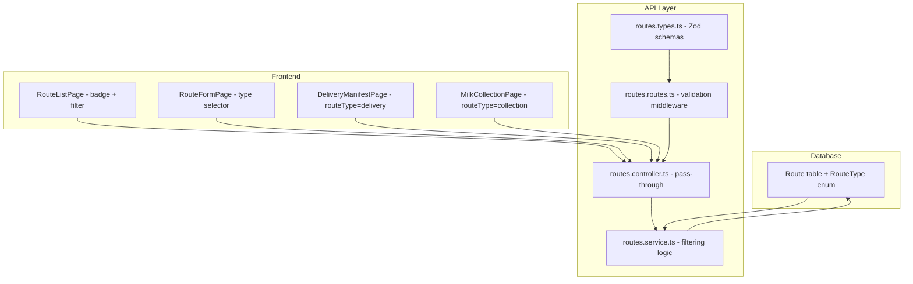

# Design Document: Route Type Classification

## Overview

This feature adds a `routeType` enum field (`delivery` | `collection`) to the Route model, enabling the platform to distinguish between milk delivery routes and milk collection routes. The change touches the database schema, API validation/filtering, and frontend UI (list page filter/badge, form selector, contextual filtering on dependent pages).

The implementation is a vertical slice: Prisma enum + migration → Zod schema updates → service/controller filtering → React UI updates.

## Architecture



The change is additive and backward-compatible. Existing routes default to `delivery`. No breaking changes to existing API consumers since `routeType` is optional on create/update and the list endpoint returns all types when the parameter is omitted.

## Components and Interfaces

### 1. Prisma Schema Changes

Add a `RouteType` enum and a `routeType` field to the `Route` model:

```prisma
enum RouteType {
  delivery
  collection
}

model Route {
  // ... existing fields ...
  routeType RouteType @default(delivery) @map("route_type")
}
```

### 2. Migration

A single Prisma migration that:
1. Creates the `RouteType` enum type in PostgreSQL
2. Adds the `route_type` column with default `delivery`
3. Backfills all existing rows to `delivery`

### 3. Zod Schema Updates (`routes.types.ts`)

```typescript
// Shared enum
export const routeTypeEnum = z.enum(['delivery', 'collection']);

// Add to createRouteSchema:
routeType: routeTypeEnum.optional()  // defaults handled by DB

// Add to updateRouteSchema:
routeType: routeTypeEnum.optional()

// Add to routeQuerySchema:
routeType: routeTypeEnum.optional()
```

### 4. Service Layer (`routes.service.ts`)

In `listRoutes`, add a `where` clause when `query.routeType` is present:

```typescript
if (query.routeType) {
  where.routeType = query.routeType;
}
```

No other service changes needed — `createRoute` and `updateRoute` already spread `input` into Prisma `data`, so the new field flows through automatically.

### 5. Controller Layer

No changes needed. The controller already passes `req.query` and `req.body` through to the service.

### 6. Frontend: RouteListPage

- Add a `routeType` filter dropdown (All / Delivery / Collection) above the table
- Pass `routeType` query param to the API when a filter is selected
- Display a badge in each row showing the route type

### 7. Frontend: RouteFormPage

- Add a `routeType` select field (Delivery / Collection) to the form
- Default to `delivery` for new routes
- Pre-populate from existing route data on edit
- Include `routeType` in the submit payload

### 8. Frontend: DeliveryManifestPage

- When fetching routes for display/selection, pass `routeType=delivery` query parameter

### 9. Frontend: MilkCollectionPage

- When fetching collection routes, pass `routeType=collection` query parameter

## Data Models

### RouteType Enum

| Value | Description |
|---|---|
| `delivery` | Route used for delivering milk to customers |
| `collection` | Route used for collecting milk from farmers/villages |

### Route Model (updated fields only)

| Field | Type | Default | Description |
|---|---|---|---|
| `routeType` | `RouteType` | `delivery` | Classification of the route's purpose |

### API Request/Response Changes

**Create Route** (`POST /api/v1/routes`):
```json
{ "name": "Route A", "routeType": "collection" }
```

**List Routes** (`GET /api/v1/routes?routeType=delivery`):
Query parameter `routeType` filters results. Omitting returns all.

**Response** (all route endpoints):
```json
{ "id": "...", "name": "Route A", "routeType": "delivery", ... }
```


## Correctness Properties

*A property is a characteristic or behavior that should hold true across all valid executions of a system — essentially, a formal statement about what the system should do. Properties serve as the bridge between human-readable specifications and machine-verifiable correctness guarantees.*

### Property 1: Route type invariant

*For any* route in the database, the `routeType` field must be one of `delivery` or `collection` — no other values are permitted.

**Validates: Requirements 1.1**

### Property 2: Default route type is delivery

*For any* route created without specifying a `routeType`, the persisted `routeType` value should be `delivery`.

**Validates: Requirements 1.2**

### Property 3: Route type round-trip

*For any* valid `routeType` value (`delivery` or `collection`), creating or updating a route with that value and then retrieving it should return the same `routeType` value.

**Validates: Requirements 2.1, 2.2**

### Property 4: Invalid route type rejection

*For any* string that is not `delivery` or `collection`, submitting it as `routeType` to the create, update, or list endpoints should result in a 400 validation error.

**Validates: Requirements 2.3, 2.4**

### Property 5: Route type filtering

*For any* set of routes with mixed `routeType` values, querying the list endpoint with a `routeType` filter should return only routes matching that type, and querying without the filter should return all routes.

**Validates: Requirements 3.1, 3.2, 3.3, 6.3**

### Property 6: Route type present in all responses

*For any* route returned by the API (single get, paginated list, manifest, or summary), the response object should include the `routeType` field with a valid enum value.

**Validates: Requirements 7.1, 7.2, 7.3**

## Error Handling

| Scenario | HTTP Status | Response |
|---|---|---|
| Invalid `routeType` value in create/update body | 400 | Zod validation error with field-level message |
| Invalid `routeType` value in query parameter | 400 | Zod validation error with field-level message |
| Valid `routeType` but no matching routes | 200 | Empty paginated result `{ data: [], pagination: { total: 0, ... } }` |

No new error types are introduced. All validation is handled by existing Zod middleware and the standard `errorHandler` middleware.

## Testing Strategy

### Unit Tests

- Zod schema validation: verify `routeTypeEnum` accepts `delivery` and `collection`, rejects other strings
- Service layer: verify `listRoutes` applies `routeType` filter to Prisma `where` clause
- Migration: verify existing routes get `delivery` as default (one-time check)

### Property-Based Tests

Use `fast-check` for property-based testing. Each property test should run a minimum of 100 iterations.

- **Property 1**: Generate random routes, verify `routeType` is always in `['delivery', 'collection']`
  - Tag: **Feature: route-type-classification, Property 1: Route type invariant**
- **Property 2**: Generate random `CreateRouteInput` without `routeType`, verify result has `routeType === 'delivery'`
  - Tag: **Feature: route-type-classification, Property 2: Default route type is delivery**
- **Property 3**: Generate random valid `routeType`, create/update route, read back, verify equality
  - Tag: **Feature: route-type-classification, Property 3: Route type round-trip**
- **Property 4**: Generate random non-enum strings, verify Zod schema rejects them
  - Tag: **Feature: route-type-classification, Property 4: Invalid route type rejection**
- **Property 5**: Generate random route sets with mixed types, apply filter, verify all results match filter
  - Tag: **Feature: route-type-classification, Property 5: Route type filtering**
- **Property 6**: For any route API response, verify `routeType` field exists and is valid
  - Tag: **Feature: route-type-classification, Property 6: Route type present in all responses**

### Integration Tests

- Create route with `routeType=collection`, verify it appears in filtered list
- DeliveryManifestPage fetches only `delivery` routes
- MilkCollectionPage fetches only `collection` routes
- Edit route to change type from `delivery` to `collection`, verify update persists
