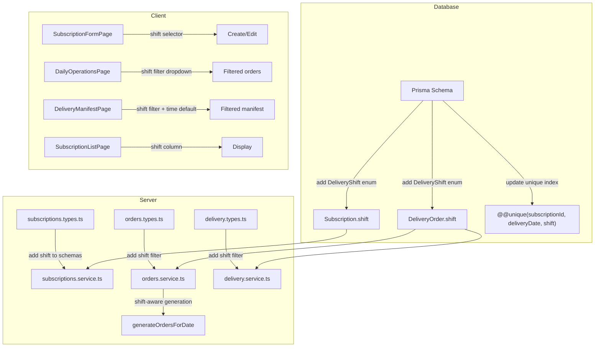

# Design Document: Shift-Based Orders

## Overview

This feature introduces a `shift` concept (morning/evening) to the milk delivery platform, enabling customers to receive deliveries in two distinct time windows per day. The shift value is modeled as a Prisma enum (`DeliveryShift`) added to both the `Subscription` and `DeliveryOrder` models. The daily order generation job, query APIs, and UI pages are updated to be shift-aware while maintaining full backward compatibility with existing data.

### Key Design Decisions

1. **Enum over string**: A Prisma enum (`DeliveryShift`) is used instead of a free-form string to enforce the closed set `{morning, evening}` at the database level.
2. **Default to `morning`**: All new and existing records default to `morning`, ensuring backward compatibility without data loss.
3. **Composite unique constraint**: The `DeliveryOrder` unique index is widened from `(subscriptionId, deliveryDate)` to `(subscriptionId, deliveryDate, shift)` to allow two orders per subscription-date when shifts differ.
4. **Shift propagation**: The order generator copies the shift value from the source `Subscription` to the generated `DeliveryOrder`, keeping the data lineage clear.

## Architecture

The change is vertical — it touches every layer from database through API to UI — but is narrow in scope. No new modules or services are introduced.



## Components and Interfaces

### 1. Prisma Schema Changes

Add a new enum and a `shift` field to two models:

```prisma
enum DeliveryShift {
  morning
  evening
}
```

**Subscription model** — add field:
```prisma
shift DeliveryShift @default(morning)
```

**DeliveryOrder model** — add field:
```prisma
shift DeliveryShift @default(morning)
```

**DeliveryOrder unique constraint** — replace:
```prisma
// Old:
@@unique([subscriptionId, deliveryDate], map: "idx_delivery_orders_unique")
// New:
@@unique([subscriptionId, deliveryDate, shift], map: "idx_delivery_orders_unique")
```

### 2. Subscription Types (`subscriptions.types.ts`)

Add `shift` to create and update schemas:

```typescript
// createSubscriptionSchema — add:
shift: z.enum(['morning', 'evening']).optional().default('morning')

// updateSubscriptionSchema — add:
shift: z.enum(['morning', 'evening']).optional()

// subscriptionQuerySchema — add:
shift: z.enum(['morning', 'evening']).optional()
```

### 3. Subscription Service (`subscriptions.service.ts`)

- **createSubscription**: Include `shift` in the Prisma `create` data. Before creating, check for an existing active subscription with the same `(customerId, productVariantId, shift)` and reject duplicates with a `ValidationError`.
- **updateSubscription**: When `shift` is provided, check for conflicts with existing active subscriptions for the same customer + variant + new shift. Record the change in `SubscriptionChange` with `changeType: 'shift'`.
- **listSubscriptions**: Pass optional `shift` filter to the Prisma `where` clause.

### 4. Order Types (`orders.types.ts`)

```typescript
// orderQuerySchema — add:
shift: z.enum(['morning', 'evening']).optional()

// createOneTimeOrderSchema — add:
shift: z.enum(['morning', 'evening']).optional().default('morning')
```

### 5. Order Service (`orders.service.ts`)

- **generateOrdersForDate**: Copy `sub.shift` into the `DeliveryOrder.create` data. Add a `byShift` field to `GenerateOrdersSummary` to report counts per shift.
- **listOrders**: Apply optional `shift` filter from `OrderQuery`.
- **getOrderSummary**: Add `byShift` grouping to the summary response.
- **createOneTimeOrder**: Accept and persist the `shift` field.

### 6. Delivery Types (`delivery.types.ts`)

```typescript
// manifestQuerySchema — add:
shift: z.enum(['morning', 'evening']).optional()
```

### 7. Delivery Service (`delivery.service.ts`)

- **getManifestFlat / getAgentManifest**: Apply optional `shift` filter to the Prisma query.
- **getAdminOverview**: Include shift breakdown in the overview response.

### 8. Client — SubscriptionFormPage

- Add a `shift` select field (`Morning` / `Evening`) to the form, defaulting to `morning`.
- Include `shift` in the create payload. On edit, allow changing the shift value.

### 9. Client — SubscriptionListPage

- Add a `Shift` column to the subscription table displaying the shift badge.
- Optionally add a shift filter dropdown to the list query.

### 10. Client — DailyOperationsPage

- Add a shift filter dropdown (`All` / `Morning` / `Evening`) above the orders table.
- Pass the selected shift as a query parameter to the orders API.
- Display shift-grouped counts in the order summary section.

### 11. Client — DeliveryManifestPage

- Add a shift filter dropdown (`All` / `Morning` / `Evening`).
- Default the filter based on local time: `morning` before 12:00 PM, `evening` at or after 12:00 PM.
- Pass the selected shift as a query parameter to the manifest API.

## Data Models

### DeliveryShift Enum

| Value     | Description                        |
|-----------|------------------------------------|
| `morning` | Morning delivery window (default)  |
| `evening` | Evening delivery window            |

### Subscription (modified)

| Field | Type           | Change   | Notes                          |
|-------|----------------|----------|--------------------------------|
| shift | DeliveryShift  | **NEW**  | Default `morning`. Not null.   |

### DeliveryOrder (modified)

| Field | Type           | Change   | Notes                          |
|-------|----------------|----------|--------------------------------|
| shift | DeliveryShift  | **NEW**  | Default `morning`. Not null.   |

### Unique Constraint Change

| Model         | Old Constraint                        | New Constraint                              |
|---------------|---------------------------------------|---------------------------------------------|
| DeliveryOrder | `(subscriptionId, deliveryDate)`      | `(subscriptionId, deliveryDate, shift)`     |

### GenerateOrdersSummary (modified)

```typescript
export interface GenerateOrdersSummary {
  totalCreated: number;
  byRoute: Record<string, number>;
  byProductVariant: Record<string, number>;
  byShift: Record<string, number>; // NEW
}
```

### Migration Strategy

The Prisma migration will:
1. Create the `DeliveryShift` enum type in PostgreSQL.
2. Add `shift` column to `subscriptions` with default `morning` — backfills all existing rows.
3. Add `shift` column to `delivery_orders` with default `morning` — backfills all existing rows.
4. Drop the old unique index `idx_delivery_orders_unique`.
5. Create the new unique index on `(subscription_id, delivery_date, shift)`.

Because the new column has a `NOT NULL DEFAULT`, the migration is non-destructive and existing data is preserved.

